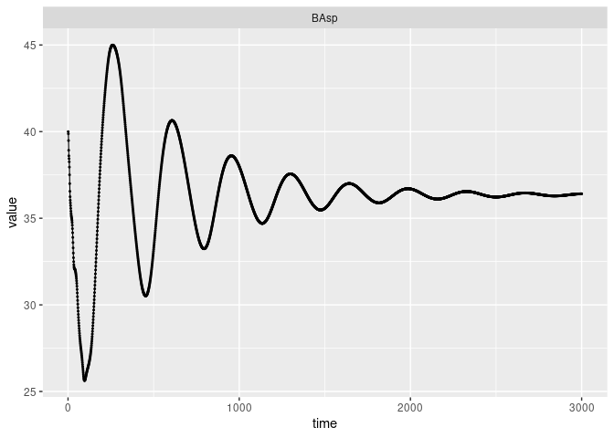
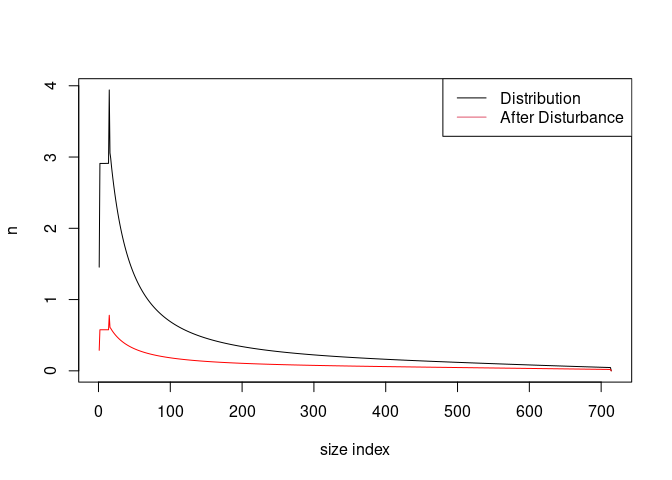
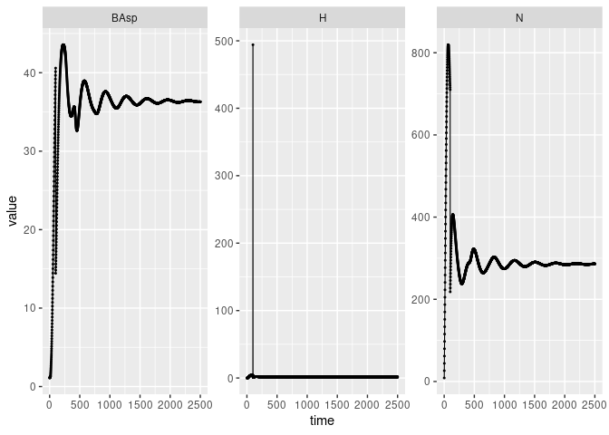
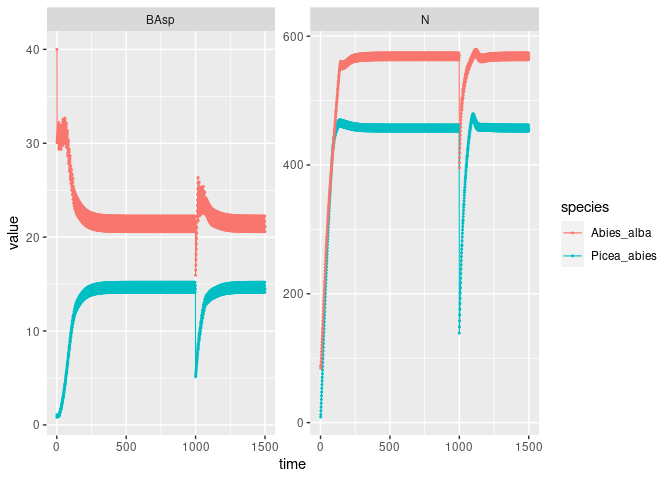
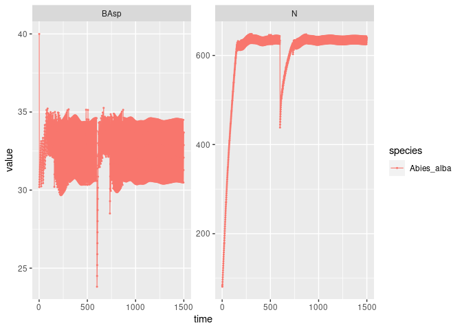
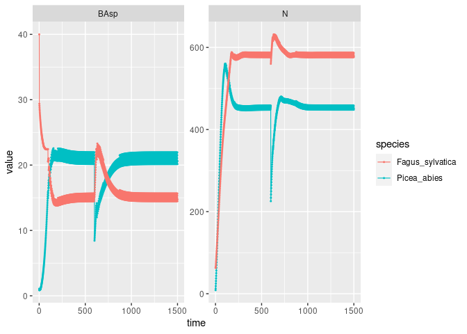

Disturbance
================

<style>
body {
text-align: justify}
</style>

------------------------------------------------------------------------

## Testing simulation with disturbances

This document show how to run simulations with disturbance occurring at
specific times. This part of the package is in experimental state. For
this document we will use the species *Picea abies* as an example.

``` r
# Libraries
library(ggplot2)
library(dplyr)
#> 
#> Attaching package: 'dplyr'
#> The following objects are masked from 'package:stats':
#> 
#>     filter, lag
#> The following object is masked from 'package:testthat':
#> 
#>     matches
#> The following objects are masked from 'package:base':
#> 
#>     intersect, setdiff, setequal, union
library(devtools)

# Loading all functions of the package
devtools::load_all()
#> ℹ Loading matreex
species <- "Picea_abies"
data(list = paste0("fit_", species))
climate <- subset(climate_species, sp == species & N == 2, select = -c(N, sp))
ipm_Picea <- make_IPM(
    "Picea_abies", climate, "opt_Picea_clim", fit = fit_Picea_abies,
    mesh = c(m = 700, L = 90, U = get_maxdbh(fit_Picea_abies) * 1.1),
    BA = 0:100, verbose = TRUE
)
#> Launching integration loop
#> GL integration occur on 32 cells
#> midbin integration occur on 25 cells
#> Loop done.
#> Time difference of 1.13 mins
Picea_abies <- species(IPM = ipm_Picea, init_pop = def_initBA(40),
                       harvest_fun = def_harv, type = "Coniferous")
```

We want to start our simulations with an equilibrium size distribution
so we compute here first

``` r
forest_ipm <- forest(species = list(Picea = Picea_abies))
time <- 3000
set.seed(42)
memor <- sim_deter_forest.forest(forest_ipm, tlim = time,
                                     equil_dist = 250, equil_time = time,
                                     verbose = TRUE, correction = "cut") 
#> Warning in sim_deter_forest.forest(forest_ipm, tlim = time, equil_dist = 250, : The equil_dist value is low and could lead to inappropriate equilibrium states. A recommended value is 1000. 
#> This warning  will be printed once by session and is desactivable with options(W_matreex_edist = FALSE)
#> apply a IPM cut correction
#> Starting while loop. Maximum t = 3000
#> time 500 | BA diff : 14.48
#> time 1000 | BA diff : 5.37
#> time 1500 | BA diff : 2.09
#> time 2000 | BA diff : 0.82
#> time 2500 | BA diff : 0.32
#> time 3000 | BA diff : 0.13
#> Simulation ended after time 3000
#> BA stabilized at 36.41 with diff of 0.13 at time 3000
#> Time difference of 14.6 secs

memor %>%
    filter(var %in% c("BAsp"), ! equil, value != 0) %>%
    ggplot(aes(x = time, y = value)) +
    facet_wrap(~ var, scales = "free_y") +
    geom_line(size = .4) + geom_point(size = .4) +
    NULL
#> Warning: Using `size` aesthetic for lines was deprecated in ggplot2 3.4.0.
#> ℹ Please use `linewidth` instead.
```

<!-- -->

``` r

equil <- memor %>%
    filter(var == "n", equil) %>% pull(value)
```

## Disturbance

### Definition of disturbance

We define a disturbance by few parameters used later in the formula.

- $I$ its intensity

- $type$ the class of disturbance. This is often a label in `"storm"`,
  `"fire"` and `"biotic"`. This is not used in the formula but to filter
  species parameters fitted.

We can set all of this in a data.frame object. We had a last column
named **IsSurv**. It’s used to tell the simulation if the survival part
of the IPM is needed during a disturbance. In this case, the data do not
allow differentiation between disturbance mortality and background
mortality. Therefore, we need to deactivate baseline mortality so that
it is not double counted.

``` r
ex_disturb <- data.frame(type = "storm", intensity = 0.5, IsSurv = FALSE)
```

### Impact on population

The disturbance impact on the population result from parameters computed
by Julien. They compose a function that takes the size distribution,
quadratic diameter of the species, intensity ($I$) and duration ($t$) of
the disturbance. A set of parameters was made for each type of
disturbance and species.

$$
dqm = \sqrt{\frac{\sum_{i=1}^m size_i^2 \times value_i}{\sum_{i=1}^m value_i}} \\
logratio = log(\frac{size}{dqm}) \\
dbh.scaled = dbh.intercept + size \times dbh.slope \\
logratio.scaled = logratio.intercept + logratio \times logratio.slope \\
X_{t+1} = X_t \times (1 - plogis(a_0 + a_1 \times logratio.scaled + b \times I^{c \times dbh.scaled}))^t 
$$ The parameters are estimated with Bayesian computations. The mean of
all estimations are stored inside the package for each combination of
species and disturbance type.

``` r
(coefs <- filter(matreex::disturb_coef, species == "Picea_abies"))
#>   disturbance     species        a0         a1        b            c
#> 1      biotic Picea_abies -5.645296  0.0000000 5.831757 -0.079284149
#> 2       storm Picea_abies -4.568872 -0.1489534 5.359453  0.003335358
#>   dbh.intercept   dbh.slope logratio.intercept logratio.slope
#> 1    -0.7868063 0.007928421          0.4682191       2.923733
#> 2    -0.7197517 0.007261211          0.1725871       2.722508
Picea_abies$disturb_coef <- coefs
```

Linked with this set of parameters, we need to provide a disturbance
function to the species we want to simulate. *The species is initiated
with an empty function that will throw warnings.*

``` r
#' Disturbance function
#' 
#' @param x population state distribution at time t
#' @param species The species class object of interest to get mesh and RDIcoef
#' values from. RDIcoef is a one line dataframe with RDI coefficient for one
#' species.
#' @param disturb Disturbance parameters. Highly depend on the disturbance 
#' impact parameters given to the species.
#' @param ... Not used in this case.
#' \describe{
#'  \item{qmd}{Forest Quadratic Mean Diameter}
#' }
#' 
#' @details
#' Delayed mesh cells takes the value of the minimal mesh size.
#'
disturb_fun <- function(x, species, disturb = NULL, ...){
    
    dots <- list(...)
    qmd <- dots$qmd 
    size <- species$IPM$mesh
    coef <- species$disturb_coef
    if(any(disturb$type %in% coef$disturbance)){
        coef <- subset(coef, disturbance == disturb$type)
    } else {
        stop(sprintf("The species %s miss this disturbance type (%s) parameters",
                     sp_name(species), disturb$type))
    }
    
    # edits for delay
    size[size == 0] <- min(size[size !=0])
    
    logratio <-  log(size / qmd)
    dbh.scaled = coef$dbh.intercept + size * coef$dbh.slope
    logratio.scaled = coef$logratio.intercept + logratio * coef$logratio.slope
    Pkill <- plogis(coef$a0 + coef$a1 * logratio.scaled + 
                        coef$b * disturb$intensity ^(coef$c * dbh.scaled))
    
    return(x* Pkill) # always return the mortality distribution
}

x <- equil
species <- Picea_abies
disturb <- data.frame(type = "storm", intensity = 0.7, IsSurv = FALSE)
qmd <-QMD(Picea_abies$IPM$mesh, equil)

ex_disturb <- data.frame(type = "storm", intensity = 0.7, IsSurv = FALSE)

Picea_abies$disturb_fun <- disturb_fun
qmd <-QMD(Picea_abies$IPM$mesh, equil)

plot(equil, type= "l", xlab = "size index", ylab = "n")
lines(1:(700 + as.numeric(Picea_abies$IPM$info["delay"])), 
      equil - disturb_fun(equil, Picea_abies, ex_disturb, qmd = qmd), 
      col = "red")
legend("topright", c("Distribution", "After Disturbance"),
       lty = c(1, 1), col = c(1, 2))
```

<!-- -->

## Simulations

Running a simulation takes the same parameters as usual, with an added
data.frame with disturbance along time. *We need to think about a clean
way to build this table…*

``` r
(disturb <- data.frame(type = "storm", intensity = 0.2, 
                       IsSurv = FALSE, t = 100))
#>    type intensity IsSurv   t
#> 1 storm       0.2  FALSE 100
```

**Disturbance size distribution is saved in harvest output. Harvest is
canceled when a disturbance happens.**

``` r
time <- 2500
Picea_abies$init_pop <- def_init_k(equil * 0.03)
Picea_abies$harvest_fun <- def_harv
forest_ipm <- forest(species = list(Picea = Picea_abies))
set.seed(42)
memor <- sim_deter_forest.forest(forest_ipm, tlim = time,
                                 equil_dist = 250, equil_time = time,
                                 disturbance  = disturb,
                                 verbose = TRUE, correction = "cut")
#> apply a IPM cut correction
#> Starting while loop. Maximum t = 2500
#> time 100 | Disturbance : storm I = 0.20
#> time 500 | BA diff : 10.43
#> time 1000 | BA diff : 2.83
#> time 1500 | BA diff : 1.12
#> time 2000 | BA diff : 0.44
#> time 2500 | BA diff : 0.17
#> Simulation ended after time 2500
#> BA stabilized at 36.30 with diff of 0.17 at time 2500
#> Time difference of 12.2 secs

memor %>%
    filter(var %in% c("BAsp", "N", "H"), ! equil, value != 0) %>%
    ggplot(aes(x = time, y = value)) +
    facet_wrap(~ var, scales = "free_y") +
    geom_line(size = .4) + geom_point(size = .4) +
    NULL
```

<!-- -->

## Multispecific simulations

What happens when we add other species ?

``` r
species <- "Abies_alba"
data(list = paste0("fit_", species))
ipm_Abies <- make_IPM(
    species, climate, "opt_Picea_clim", fit = fit_Abies_alba,
    mesh = c(m = 700, L = 90, U = get_maxdbh(fit_Abies_alba) * 1.1),
    BA = 0:100, verbose = TRUE
)
#> Launching integration loop
#> GL integration occur on 24 cells
#> midbin integration occur on 25 cells
#> Loop done.
#> Time difference of 38 secs
Abies_alba <- species(
    IPM = ipm_Abies, init_pop = def_initBA(40),
    harvest_fun = def_harv, disturb_fun = disturb_fun, 
    disturb_coef = filter(matreex::disturb_coef, species == "Abies_alba",),
    type = "Coniferous"
)
```

``` r
time <- 1500
(disturb <- data.frame(type = "storm", intensity = 0.2, 
                       IsSurv = FALSE, t = 1000))
#>    type intensity IsSurv    t
#> 1 storm       0.2  FALSE 1000

Picea_abies$harvest_fun <- Uneven_harv
Abies_alba$harvest_fun <- Uneven_harv
forest_nsp <- forest(species = list(Picea = Picea_abies, Abies = Abies_alba))
set.seed(42)
memor_nsp <- sim_deter_forest.forest(forest_nsp, tlim = time,
                                 equil_dist = 250, equil_time = time,
                                 disturbance  = disturb,
                                 harvest = "Uneven", targetBA = 30,
                                 verbose = TRUE, correction = "cut")
#> apply a IPM cut correction
#> Starting while loop. Maximum t = 1500
#> time 500 | BA diff : 2.72
#> time 1000 | Disturbance : storm I = 0.20
#> time 1000 | BA diff : 16.36
#> time 1500 | BA diff : 2.71
#> Simulation ended after time 1500
#> BA stabilized at 35.63 with diff of 2.71 at time 1500
#> Time difference of 13.5 secs

memor_nsp %>%
    filter(var %in% c("BAsp", "N"), ! equil) %>%
    ggplot(aes(x = time, y = value, color = species)) +
    facet_wrap(~ var, scales = "free_y") +
    geom_line(size = .4) + geom_point(size = .4) +
    NULL
```

<!-- -->

## Delay

I test delay here just to be sure. And there was a bug in get_step_IPM
so I was right.

``` r
load_all()
#> ℹ Loading matreex
time <- 1500
(disturb <- data.frame(type = "storm", intensity = 0.2, 
                       IsSurv = FALSE, t = 600))
#>    type intensity IsSurv   t
#> 1 storm       0.2  FALSE 600
forest_d <- forest(species = list(Abies = delay(Abies_alba, 5)))
set.seed(42)
memor_d <- sim_deter_forest.forest(forest_d, tlim = time,
                                 equil_dist = 250, equil_time = time,
                                 disturbance  = disturb,
                                 harvest = "Uneven", targetBA = 30,
                                 verbose = TRUE, correction = "cut")
#> Warning in sim_deter_forest.forest(forest_d, tlim = time, equil_dist = 250, : The equil_dist value is low and could lead to inappropriate equilibrium states. A recommended value is 1000. 
#> This warning  will be printed once by session and is desactivable with options(W_matreex_edist = FALSE)
#> apply a IPM cut correction
#> Starting while loop. Maximum t = 1500
#> time 500 | BA diff : 5.32
#> time 600 | Disturbance : storm I = 0.20
#> time 1000 | BA diff : 5.28
#> time 1500 | BA diff : 4.15
#> Simulation ended after time 1500
#> BA stabilized at 33.69 with diff of 4.15 at time 1500
#> Time difference of 7.3 secs

memor_d %>%
    filter(var %in% c("BAsp", "N"), ! equil) %>%
    ggplot(aes(x = time, y = value, color = species)) +
    facet_wrap(~ var, scales = "free_y") +
    geom_line(size = .4) + geom_point(size = .4) +
    NULL
```

<!-- -->

## Linear stabilizing effect of species mixture

I create a broadleaf species (*Fagus sylvatica*) in order to mix with
the previous coniferous species. Note that I specified the type of the
tree for each species. This was optionnal with previous simulations, but
we will edit the disturbance function in order to take that information
into account.

``` r
species <- "Fagus_sylvatica"
data(list = paste0("fit_", species))
ipm_Fagus <- make_IPM(
    species, climate, "opt_Picea_clim", fit = fit_Fagus_sylvatica,
    mesh = c(m = 700, L = 90, U = get_maxdbh(fit_Fagus_sylvatica) * 1.1),
    BA = 0:100, verbose = TRUE
)
#> Launching integration loop
#> GL integration occur on 21 cells
#> midbin integration occur on 25 cells
#> Loop done.
#> Time difference of 32.5 secs
Fagus_sylvatica <- species(
    IPM = ipm_Fagus, init_pop = def_initBA(40),
    harvest_fun = def_harv, disturb_fun = disturb_fun, 
    disturb_coef = filter(matreex::disturb_coef, species == "Fagus_sylvatica"),
    type = "Broadleaf"
)
Fagus_sylvatica$harvest_fun <- Uneven_harv
```

The disturbance function need to be edited, to accept the input of the
coniferous percentage computed at the plot scale before disturbing each
species and to modify the mortality probability (`Pkill`) if the species
is a coniferous.

``` r
#' Disturbance function
#' 
#' @param x population state distribution at time t
#' @param species The species class object of interest to get mesh and RDIcoef
#' values from. RDIcoef is a one line dataframe with RDI coefficient for one
#' species.
#' @param disturb Disturbance parameters. Highly depend on the disturbance 
#' impact parameters given to the species.
#' @param ... Not used in this case.
#' \describe{
#'  \item{qmd}{Forest Quadratic Mean Diameter}
#' }
#' 
#' @details
#' Delayed mesh cells takes the value of the minimal mesh size.
#'
disturb_fun <- function(x, species, disturb = NULL, ...){
    
    dots <- list(...)
    qmd <- dots$qmd
    coni_perc <- dots$perc_coni
    size <- species$IPM$mesh
    coef <- species$disturb_coef # EDITED HERE**********************************
    if(any(disturb$type %in% coef$disturbance)){
        coef <- subset(coef, disturbance == disturb$type)
    } else {
        stop(sprintf("The species %s miss this disturbance type (%s) parameters",
                     sp_name(species), disturb$type))
    }
    
    # edits for delay
    size[size == 0] <- min(size[size !=0])
    
    logratio <-  log(size / qmd)
    dbh.scaled = coef$dbh.intercept + size * coef$dbh.slope
    logratio.scaled = coef$logratio.intercept + logratio * coef$logratio.slope
    Pkill <- plogis(coef$a0 + coef$a1 * logratio.scaled + 
                        coef$b * disturb$intensity ^(coef$c * dbh.scaled))
    
    # EDITED HERE #*************************************************************
    # Jasper equation
    if(species$info["type"] == "Coniferous" && disturb$type == "biotic"){
        # just a message to check for me
        message(sprintf("sp : %s | coni : %.3f | modif : %.2f", 
                        species$info["species"], coni_perc, 
                        (0.4767 + 0.6015 * coni_perc)))
        Pkill <- Pkill * (0.4767 + 0.6015 * coni_perc)
    }
    # End of Edit #*************************************************************
    
    
    Pkill <- pmin(Pkill, 1)
    
    return(x* Pkill) # always return the mortality distribution
}
```

This is an example simulation. This is important to have a biotic
disturbance as well as to

``` r
time <- 1500
(disturb <- data.frame(type = "biotic", intensity = 0.2, 
                       IsSurv = FALSE, t = 600))
#>     type intensity IsSurv   t
#> 1 biotic       0.2  FALSE 600
# Giving the new disturb_fun
Picea_abies$disturb_fun <- disturb_fun
Fagus_sylvatica$disturb_fun <- disturb_fun
# The effect is only applied on the tree of type "Coniferous"
# Picea_abies$info["type"] <- "Coniferous"
Picea_abies$info["type"]
#>         type 
#> "Coniferous"
forest_nsp <- forest(species = list(Picea = Picea_abies, Fagus = Fagus_sylvatica))
set.seed(42)
jasper_nsp <- sim_deter_forest.forest(forest_nsp, tlim = time,
                                 equil_dist = 250, equil_time = time,
                                 disturbance  = disturb,
                                 harvest = "Uneven", targetBA = 30,
                                 verbose = TRUE, correction = "cut")
#> apply a IPM cut correction
#> Starting while loop. Maximum t = 1500
#> time 500 | BA diff : 2.99
#> time 600 | Disturbance : biotic I = 0.20
#> sp : Picea_abies | coni : 0.438 | modif : 0.74
#> time 1000 | BA diff : 3.05
#> time 1500 | BA diff : 2.98
#> Simulation ended after time 1500
#> BA stabilized at 35.38 with diff of 2.98 at time 1500
#> Time difference of 13.5 secs

jasper_nsp %>%
    filter(var %in% c("BAsp", "N"), ! equil) %>%
    ggplot(aes(x = time, y = value, color = species)) +
    facet_wrap(~ var, scales = "free_y") +
    geom_line(size = .4) + geom_point(size = .4) +
    NULL
```

<!-- -->

To desactivate this effect, there is just a modification of the species
type. This is not biological accurate, I can add a third option like NA
later if it’s not that clear.

``` r
Picea_abies$info["type"] <- "Broadleaf"
forest_nsp <- forest(species = list(Picea = Picea_abies, Fagus = Fagus_sylvatica))
set.seed(42)
memor_nsp <- sim_deter_forest.forest(forest_nsp, tlim = time,
                                 equil_dist = 250, equil_time = time,
                                 disturbance  = disturb,
                                 harvest = "Uneven", targetBA = 30,
                                 verbose = TRUE, correction = "cut")
#> apply a IPM cut correction
#> Starting while loop. Maximum t = 1500
#> time 500 | BA diff : 2.99
#> time 600 | Disturbance : biotic I = 0.20
#> time 1000 | BA diff : 3.03
#> time 1500 | BA diff : 2.98
#> Simulation ended after time 1500
#> BA stabilized at 36.12 with diff of 2.98 at time 1500
#> Time difference of 13.4 secs
```

I compare the two simulations in order to check the presence of the
effect. As seen above in messages, the mortality is multiplied by 0.74,
which we see here with the blue line under the red one for *Picea
abies*.

*Yes, the disturbance mortality is saved in the harvest variable since
there is no harvest when there is a disturbance.*

``` r
bind_rows(mixture = jasper_nsp, basic =  memor_nsp, .id = "jasper") %>% 
    filter(var == "h", time == 600) %>%
    ggplot(aes(x = mesh, y = value, color = jasper)) + 
    facet_wrap(~ species, scales = "free_y") +
    geom_line(size = .4) + geom_point(size = .4) +
    NULL
```

<!-- -->
