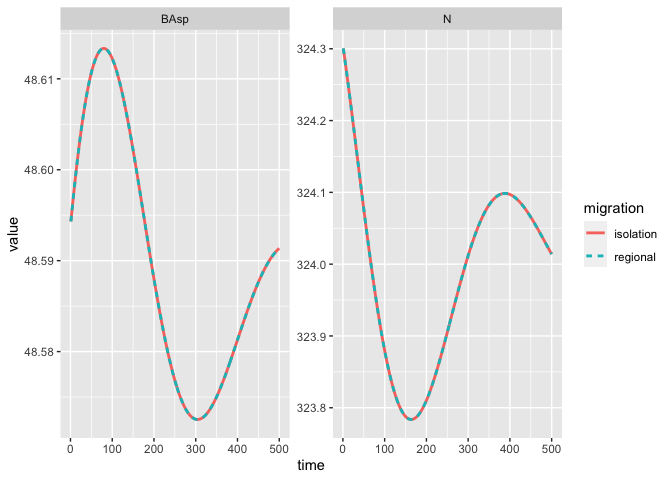
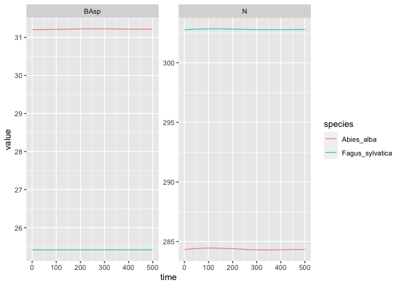
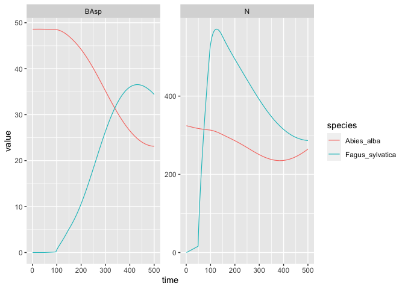
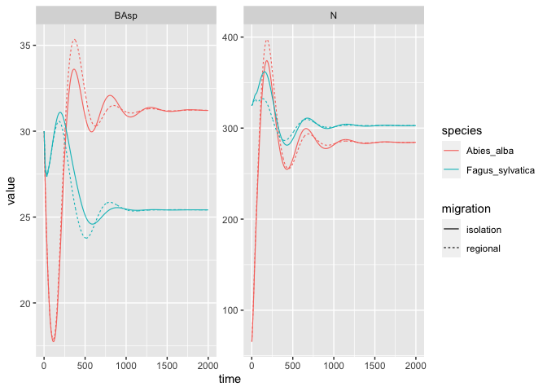

No forest is an island
================
Maxime Jaunatre
2023-08-31

## Introduction

This document is set to test the different migration or mosaic setups
and develop code to simulate this. This is purely experimental and rely
on the dev branch of the `{matreex}` package.

``` r
devtools::load_all()
```

    ## ℹ Loading matreex

``` r
library(dplyr)
```

    ## 
    ## Attaching package: 'dplyr'
    ## 
    ## The following objects are masked from 'package:stats':
    ## 
    ##     filter, lag
    ## 
    ## The following object is masked from 'package:testthat':
    ## 
    ##     matches
    ## 
    ## The following objects are masked from 'package:base':
    ## 
    ##     intersect, setdiff, setequal, union

``` r
library(ggplot2)
options(W_matreex_edist = FALSE)
options(cli.progress_show_after = 600) 
```

## Regional pool

The idea is to add recruitment from a regional pool with a constant
proportion of species and add the recruit produced with a migration
rate.

The recruitment function for a species $s$ is edited such that :

$$
R_s = \alpha BA_s^\beta \cdot e^{-\delta BA_s} \cdot e^{-\epsilon BA_h}\\
R_s = [(1-m)\alpha BA_s^\beta +  m \alpha BA_r^\beta] \cdot e^{-\delta BA_s} \cdot e^{-\epsilon BA_h}
$$

$BA_s$ is the local basal area of the species, $BA_r$ is the regional
basal area of the species and $BA_h$ is the local basal area of other
species. $\alpha$, $\beta$, $\delta$ and $\epsilon$ are parameters
fitted for each species. $m \in R: 0 \leq m \leq 1$

To simplify, the recruitment is impacted by regional fecundity, but the
competition is still local.

### Implementation

This is just the creation of the species required for latter
simulations, not much fun yet.

``` r
data("fit_Abies_alba")
data("climate_species")
climate <- subset(climate_species, N == 2 & sp == "Abies_alba", select = -sp)
climate
```

    ##       sgdd       wai        sgddb      waib      wai2   sgdd2      PC1
    ## 2 1823.735 0.4460047 0.0005483254 0.6915607 0.1989202 3326008 1.340515
    ##         PC2 N       SDM
    ## 2 0.3391797 2 0.1120306

``` r
Abies_ipm <- make_IPM(
    species = "Abies_alba",
    climate = climate,
    fit = fit_Abies_alba,
    clim_lab = "optimum clim",
    mesh = c(m = 700, L = 90, U = get_maxdbh(fit_Abies_alba) * 1.1),
    BA = 0:120,
    verbose = TRUE
)
```

    ## Launching integration loop

    ## GL integration occur on 24 cells

    ## midbin integration occur on 25 cells

    ## Loop done.

    ## Time difference of 1.26 mins

``` r
Abies_sp <- species(IPM = Abies_ipm, init_pop = def_initBA(30))
Abies_for <- forest(species = list(Abies = Abies_sp))
set.seed(42) # The seed is here for initial population random functions.
Abies_sim <- sim_deter_forest(
    Abies_for,
    tlim = 2000,
    equil_time = 2000, equil_dist = 1, equil_diff = 1,
    SurfEch = 0.03,
    verbose = TRUE
)
```

    ## Starting while loop. Maximum t = 2000

    ## time 500 | BA diff : 0.02

    ## time 1000 | BA diff : 0.01

    ## time 1500 | BA diff : 0.00

    ## time 2000 | BA diff : 0.00

    ## Simulation ended after time 2000

    ## BA stabilized at 48.60 with diff of 0.00 at time 2000

    ## Time difference of 11.1 secs

``` r
data("fit_Fagus_sylvatica")
Fagus_ipm <- make_IPM(
    species = "Fagus_sylvatica",
    climate = climate,
    fit = fit_Fagus_sylvatica,
    clim_lab = "optimum clim",
    mesh = c(m = 700, L = 90, U = get_maxdbh(fit_Fagus_sylvatica) * 1.1),
    BA = 0:120, # Default values are 0:200, smaller values speed up this vignette.
    verbose = TRUE
)
```

    ## Launching integration loop

    ## GL integration occur on 21 cells

    ## midbin integration occur on 25 cells

    ## Loop done.

    ## Time difference of 49.3 secs

``` r
Fagus_sp <- species(IPM = Fagus_ipm, init_pop = def_initBA(30))
AbFa_for <- forest(species = list(Abies = Abies_sp,  Fagus = Fagus_sp))
set.seed(42) # The seed is here for initial population random functions.
AbFa_sim <- sim_deter_forest(
    AbFa_for,
    tlim = 2000,
    equil_time = 2000, equil_dist = 1, equil_diff = 1,
    SurfEch = 0.03,
    verbose = TRUE
)
```

    ## Starting while loop. Maximum t = 2000

    ## time 500 | BA diff : 0.03

    ## time 1000 | BA diff : 0.01

    ## time 1500 | BA diff : 0.00

    ## time 2000 | BA diff : 0.00

    ## Simulation ended after time 2000

    ## BA stabilized at 56.62 with diff of 0.00 at time 2000

    ## Time difference of 19.6 secs

Now forest class require to have regional abundance, that is basal area
and migration rate. These values are required to follow the order of the
species.

``` r
### regional forest class ####
#' species are initiated with their own functions and only the regional abundance
#' is set in the forest object as well as the migration rate

#' Constructor for forest class
#'
#' Only used in the matreex package
#'
#' @param species List of species created with matreex package.
#' @param harv_rules Vector for harvest rules at the scale of the forest.
#' \describe{
#'   \item{Pmax}{maximum proportion of BAcut / BA}
#'   \item{dBAmin}{the minimum BA to perform cut}
#'   \item{freq}{Frequence at which the harvest will be executed.}
#' }
#' @param regional_abundance list of vector with size distribution for each species.
#' This is not a direct species relative abundance, but I don't know how to implement this...help ,
#' @param migration_rate numeric vector with a migration rate in percentage between 1 et and 0.
#'
#' @importFrom purrr map_chr
#'
#' @keywords internal
#' @export
new_forest <- function(species = list(),
                       harv_rules = c(Pmax = 0.25, dBAmin = 3, freq = 1, alpha = 1),
                       regional_abundance = NULL,
                       migration_rate = NULL
){

    sp <- map_chr(species, sp_name)
    names(species) <- sp
    if(!is_null(regional_abundance)){
        names(regional_abundance) <- sp
        names(migration_rate) <- sp
    }
    forest <- list(
        species = species, harv_rules = harv_rules,
        info = list(species = sp,
                    clim_lab = map_chr(species, climatic)),
        regional_abundance = regional_abundance,
        migration_rate = migration_rate
    )

    if(!is_null(regional_abundance)){
        class(forest) <- c("forest", "reg_forest")
    } else {
        class(forest) <- "forest"
    }

    return(forest)
}

#' validator for forest class.
#'
#' @param x forest class object
#'
#' @import checkmate
#'
#' @noRd
validate_forest <- function(x){

    regional <- inherits(x, "reg_forest")
    values <- unclass(x)
    names <- attr(x, "names")

    map(values$species, validate_species)
    # TODO check forest harv rules

    clim_lab <- values$info$clim_lab
    if(length(unique(clim_lab)) > 1){
        clim_ipm <- clim_lab[clim_lab != "mu_gr"]
        if(length(clim_ipm) > 1){ # D & F
            stop(paste0("Some ipm species are not defined with the same climatic name.",
                        "Check it with : map_chr(species, climatic)"))
        }
    }

    # check the regional pool settings
    if(regional){

        assertNumeric(values$migration_rate, len = length(values$species),
                      lower = 0, upper = 1)
        if(all(values$migration_rate == 0)){
            warning("All migration rate are 0, the regional pool of this forest is deleted")
            x$regional_abundance <- NULL
            x$migration_rate <- NULL
            class(x) <- "forest"

            return(invisible(x))
        }

        assertSubset(names(values$migration_rate), names(values$species))
        # length_meshs <- map_dbl(values$species, ~ length(.x$IPM$mesh))

        # assertList(values$regional_abundance, types = "numeric",
                   # len = length(values$species))
        # if(any(lengths(values$regional_abundance) != length_meshs)){
            # stop("regional abundance numeric vector should be the length of the species mesh.")
        # }

        assertSubset(names(values$regional_abundance), names(values$species))
    }

    invisible(x)
}

#' Create a new forest for simulation
#'
#' A forest is a group of one of multiple species to silumate along time using
#' the IPM defined for each species and harvest rules.
#'
#' @inheritParams new_forest
#'
#' @export
forest <- function(species = list(),
                   harv_rules = c(Pmax = 0.25, dBAmin = 3, freq = 1, alpha = 1),
                   regional_abundance = NULL,
                   migration_rate = NULL
){

    res <- validate_forest(new_forest(
        species = species,
        harv_rules = harv_rules,
        regional_abundance = regional_abundance,
        migration_rate = migration_rate
    ))

    return(res)
}
```

Another key edit is that we need to create an alternative recruitment
function where the fecundity rely on the regional basal area. The
default recruitment function is $rec\_fun(BA_s, BA_h)$ and the new one
is $rec\_fun_{regional}(BA_s, BA_r, BA_h)$ :

$$
R_s = (1-m) \cdot rec\_fun(BA_s, BA_h) + m \cdot rec\_fun_{regional}(BA_s, BA_r, BA_h)
$$

$$
R_s = (1-m)\alpha BA_s^\beta \cdot e^{-\delta BA_s} \cdot e^{-\epsilon BA_h} + m \alpha BA_r^\beta \cdot e^{-\delta BA_s} \cdot e^{-\epsilon BA_h}
$$

This edit is possible with the `regional` option of the internal
function `exp_recFun()`.

``` r
list_covs <- climate
params <- fit_Abies_alba$rec$params_m
matreex:::exp_recFun(params, list_covs)
```

    ## function (BATOTSP, BATOTNonSP, mesh, SurfEch = 0.03) 
    ## {
    ##     intercept <- -0.336241732611141
    ##     res <- 0
    ##     BATOTNonSP_in <- -0.0318279138362221 * BATOTNonSP
    ##     BATOTSP_in <- -0.0438755574955998 * BATOTSP
    ##     logBATOTSP_in <- -0.00443627314063497 * log(BATOTSP)
    ##     res <- res + intercept
    ##     res <- res + BATOTNonSP_in
    ##     res <- res + BATOTSP_in
    ##     res <- res + logBATOTSP_in
    ##     mesh <- length(mesh)
    ##     distrib <- c(rep(1/2, 2), numeric(mesh - 2))
    ##     final <- exp(res) * SurfEch/0.03 * distrib
    ##     return(final)
    ## }
    ## <environment: 0x5620e1118788>

``` r
matreex:::exp_recFun(params, list_covs, regional = TRUE)
```

    ## function (BATOTSP, BAFecSP, BATOTNonSP, mesh, SurfEch = 0.03) 
    ## {
    ##     intercept <- -0.336241732611141
    ##     res <- 0
    ##     BATOTNonSP_in <- -0.0318279138362221 * BATOTNonSP
    ##     BATOTSP_in <- -0.0438755574955998 * BATOTSP
    ##     logBAFecSP_in <- -0.00443627314063497 * log(BAFecSP)
    ##     res <- res + intercept
    ##     res <- res + BATOTNonSP_in
    ##     res <- res + BATOTSP_in
    ##     res <- res + logBAFecSP_in
    ##     mesh <- length(mesh)
    ##     distrib <- c(rep(1/2, 2), numeric(mesh - 2))
    ##     final <- exp(res) * SurfEch/0.03 * distrib
    ##     return(final)
    ## }
    ## <environment: 0x5620de61a310>

\*This edit highlight that our simulation are heavily dependant on the
basal area for competition and not very open for other competition
indices.

### Simulations

Now are several examples to test if it works.

First, I start from equilibrium and compare with and without migration.
I expect no differences.

``` r
equil_dist <- dplyr::filter(Abies_sim, equil, var == "n") %>% dplyr::pull(value)
equil_BA <- dplyr::filter(Abies_sim, equil, var == "BAsp") %>% dplyr::pull(value)


Abies_spE <- Abies_sp
Abies_spE$init_pop <- def_init_k(equil_dist)
comp_time <- 500

regional_Abies <- forest(
    species = list(Abies = Abies_spE),
    regional_abundance = equil_BA,
    migration_rate = c(Abies = 0.05)
)

regional_sim <- sim_deter_forest(
    regional_Abies,
    tlim = comp_time,
    equil_time = comp_time, equil_dist = 10,
    SurfEch = 0.03,
    verbose = TRUE
)
```

    ## Simulation with regional pool

    ## Starting while loop. Maximum t = 500

    ## time 500 | BA diff : 0.00

    ## Simulation ended after time 500

    ## BA stabilized at 48.59 with diff of 0.00 at time 500

    ## Time difference of 3.11 secs

``` r
isol_sim <- sim_deter_forest(
    forest(
        species = list(Abies = Abies_spE),
        regional_abundance = list(Abies = equil_dist),
        migration_rate = c(Abies = 0)
    ),
    tlim = comp_time,
    equil_time = comp_time, equil_dist = 10,
    SurfEch = 0.03,
    verbose = TRUE
)
```

    ## Warning in validate_forest(new_forest(species = species, harv_rules =
    ## harv_rules, : All migration rate are 0, the regional pool of this forest is
    ## deleted

    ## Starting while loop. Maximum t = 500

    ## time 500 | BA diff : 0.00

    ## Simulation ended after time 500

    ## BA stabilized at 48.59 with diff of 0.00 at time 500

    ## Time difference of 2.7 secs

``` r
regional_pool <- dplyr::bind_rows(regional = regional_sim, isolation = isol_sim,
                                  .id = "migration")

regional_pool %>%
    dplyr::filter(var %in% c("BAsp", "N"), !equil) %>%
    ggplot(aes(x = time, y = value, color = migration, linetype = migration)) +
    geom_line(linewidth = 1) +
    facet_wrap(~ var, scales =  "free_y") +
    NULL
```

<!-- -->

Now we test two species. I expect no variations from equilibrium because
we start from equilibrium and the regional pool is at equilibrium.

``` r
e2_dist <- dplyr::filter(AbFa_sim, equil, var == "n") %>%
    dplyr::group_by(species) %>%
    dplyr::group_split() %>% map(pull, value)
e2_BA <- dplyr::filter(AbFa_sim, equil, var == "BAsp") %>% dplyr::pull(value)


Abies_spEn <- Abies_sp
Abies_spEn$init_pop <- def_init_k(e2_dist[[1]])
Fagus_spEn <- Fagus_sp
Fagus_spEn$init_pop <- def_init_k(e2_dist[[2]])


regional_AbFa <- forest(
    species = list(Abies = Abies_spEn, Fagus = Fagus_spEn),
    regional_abundance = e2_BA,
    migration_rate = c(Abies = 0.1, Fagus = 0.1)
)

sp2_sim <- sim_deter_forest(
    regional_AbFa,
    tlim = comp_time,
    equil_time = comp_time, equil_dist = 10,
    SurfEch = 0.03,
    verbose = TRUE
)
```

    ## Simulation with regional pool

    ## Starting while loop. Maximum t = 500

    ## time 500 | BA diff : 0.00

    ## Simulation ended after time 500

    ## BA stabilized at 56.64 with diff of 0.00 at time 500

    ## Time difference of 5.31 secs

``` r
sp2_sim %>%
    dplyr::filter(var %in% c("BAsp", "N"), !equil) %>%
    ggplot(aes(x = time, y = value, color = species)) +
    geom_line(linewidth = .4) +
    facet_wrap(~ var, scales =  "free_y") +
    NULL
```

<!-- -->

One species is absent and colonise from regional pool. **Note : starting
a simulation with a species with 0 effectif is generally a bad idea, now
it’s possible but do NOT abuse this possibility !**

I expect the new species to grow, but the lag will be visible. I don’t
simulate until equilibrium, but I guess it’s reached at some point.

``` r
Fagus_spE0 <- Fagus_sp
Fagus_spE0$init_pop <- def_init_k(e2_dist[[2]] * 0)
```

    ## Warning in def_init_k(e2_dist[[2]] * 0): sum(x) is equal to 0, the species will
    ## not be present in the forest. Be sure this is intentional.

``` r
invasive_AbFa <- forest(
    species = list(Abies = Abies_spE, Fagus = Fagus_spE0),
    regional_abundance = e2_BA,
    migration_rate = c(Abies = 0.1, Fagus = 0.1)
)

invas_sim <- sim_deter_forest(
    invasive_AbFa,
    tlim = comp_time,
    equil_time = comp_time, equil_dist = 10,
    SurfEch = 0.03,
    verbose = TRUE
)
```

    ## Simulation with regional pool

    ## Starting while loop. Maximum t = 500

    ## time 500 | BA diff : 0.58

    ## Simulation ended after time 500

    ## BA stabilized at 57.53 with diff of 0.58 at time 500

    ## Time difference of 5.3 secs

``` r
invas_sim %>%
    dplyr::filter(var %in% c("BAsp", "N"), !equil) %>%
    ggplot(aes(x = time, y = value, color = species)) +
    geom_line(linewidth = .4) +
    facet_wrap(~ var, scales =  "free_y") +
    NULL
```

<!-- -->

With the same start as those I used when looking from equilibrium, I
expect to reach equilibrium faster. This is because the recruitment is
drived by the regional pool. However, this speed might be dependant on
the migration rate.

``` r
rand_AbFa <- forest(species = list(Abies = Abies_sp,  Fagus = Fagus_sp),
                    regional_abundance = e2_BA,
                    migration_rate = c(Abies = 0.5, Fagus = 0.5)
)

set.seed(42)
rand_sim <- sim_deter_forest(
    rand_AbFa,
    tlim = 2000,
    equil_time = 2000, equil_dist = 10,
    SurfEch = 0.03,
    verbose = TRUE
)
```

    ## Simulation with regional pool

    ## Starting while loop. Maximum t = 2000

    ## time 500 | BA diff : 0.34

    ## time 1000 | BA diff : 0.04

    ## time 1500 | BA diff : 0.00

    ## time 2000 | BA diff : 0.00

    ## Simulation ended after time 2000

    ## BA stabilized at 56.63 with diff of 0.00 at time 2000

    ## Time difference of 23.1 secs

``` r
works <- dplyr::bind_rows(regional = rand_sim, isolation = AbFa_sim,
                 .id = "migration")

works %>%
    dplyr::filter(var %in% c("BAsp", "N"), !equil) %>%
    ggplot(aes(x = time, y = value, color = species, linetype = migration)) +
    geom_line(linewidth = .4) +
    facet_wrap(~ var, scales =  "free_y") +
    NULL
```

<!-- -->
