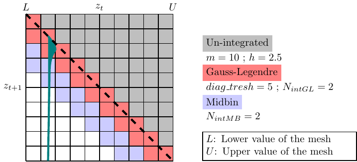
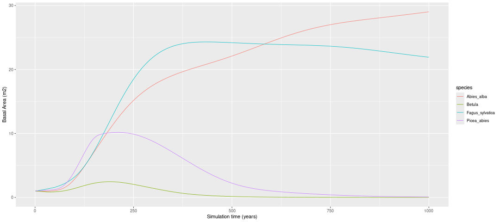
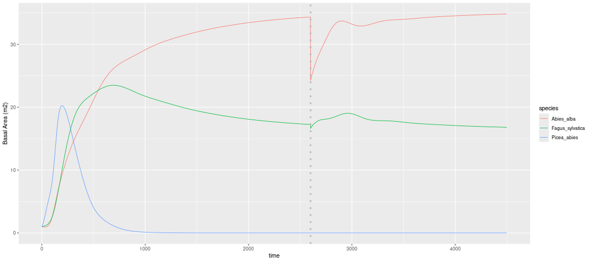

<!--docker run --rm --volume $PWD/inst/paper:/data  --user $(id -u):$(id -g) --env JOURNAL=joss openjournals/inara -->

# Summary

Integrated projection models (IPMs) are powerful tools for studying the temporal dynamics of populations structured by continuous traits, allowing predictions of changes in trait distributions over time [@ellner2016]. Unlike individual-based or cohort-based models, which represent populations as finite (discrete) populations, IPMs describe populations as infinite (continuous) populations, integrating over the uncertainty of demographic processes. This removes demographic stochasticity and results in fully deterministic simulations which is complementary to IBM models. IPMs are rarely applied to forest ecosystems due to the complexity of tree growth kernels, which are challenging to integrate, making the construction of forest IPMs particularly difficult.

Here, we introduce an R package specifically designed to build IPMs for European forest tree species. Our package includes fitted species-specific functions of growth, survival and recruitment accounting for the effect of climate and competition, and functions to efficiently integrate IPMs and run temporal simulations of single-species or multispecies forest communities until equilibrium. We also included the possibility to simulate natural disturbances (storm, fire, biotic and snow) affecting population survival depending on tree species sensitivity and stand structure. This package complements existing R packages for IPMs, such as `ipmr` [@Metcalf2013] and `IPMpack` [@Levin2021], which are not specifically designed for forest ecosystems.

# Statement of need

`matreex` is an R package specifically designed to build IPMs and run simulations for European forests. Other, more generalist, packages exist to build IPMs for various types of organisms (`IPMpack` [@Metcalf2013], `ipmr` [@Levin2021]). In addition `matreex` integrates numerous functions to run simulations for multispecies communities with harvesting and disturbance scenarios.

# Software design

A specificity of `matreex` package is the development of IPM integration functions focused on trees. As trees have a small annual growth rate, most of the integration effort is put near the diagonal of the matrix. We achieve this by combining different integration methods (Gauss-Legendre and Mid-bin) at different distances of the diagonal, which helps speed up the integration. This speed is crucial as we integrated a matrix per competition level (based on species basal area) to account for density dependence. More details about the integration are provided in the [`matreex` webpage](https://lessem.pages-forge.inrae.fr/rpackages/matreex/articles/building_ipm.html)



A crucial development effort was also to simplify usage for ecological researchers, who may work on multi-specific models with climate variation, disturbances, and harvesting. This is made easier by providing fitted vital models for European tree species directly in the package [@kunstler2021; @guyennon2023; @barrere2024], although other new models can still be used. The object-oriented method limits the complexity of the code so that users can concentrate on setting up large simulation experiments to tackle their ecological questions.

```
library(matreex)
library(dplyr)
library(ggplot2)

# select a climate to run in
data("climate_species")
climate <- subset(climate_species, N == 2 & sp == "Fagus_sylvatica", select = -sp)

# integrate ipms and integrate them in species object
Picea <- species(IPM = make_IPM(
    species = "Picea_abies", fit = fit_Picea_abies,
    climate = climate, clim_lab = "optimum clim", 
    mesh = c(m = 700, L = 90, U = get_maxdbh(fit_Picea_abies) * 1.1),
    BA = 0:60
), init_pop = def_initBA(1))
Betula <- species(IPM = make_IPM(
    species = "Betula", fit = fit_Betula,
    climate = climate, clim_lab = "optimum clim", 
    mesh = c(m = 700, L = 90, U = get_maxdbh(fit_Betula) * 1.1),
    BA = 0:60
), init_pop = def_initBA(1))
Fagus <- species(IPM = make_IPM(
    species = "Fagus_sylvatica", fit = fit_Fagus_sylvatica,
    climate = climate, clim_lab = "optimum clim", 
    mesh = c(m = 700, L = 90, U = get_maxdbh(fit_Fagus_sylvatica) * 1.1),
    BA = 0:60
), init_pop = def_initBA(1))
Abies <- species(IPM = make_IPM(
    species = "Abies_alba", fit = fit_Abies_alba,
    climate = climate, clim_lab = "optimum clim", 
    mesh = c(m = 700, L = 90, U = get_maxdbh(fit_Abies_alba) * 1.1),
    BA = 0:60
), init_pop = def_initBA(1))

# assemble species in a forest object
Forest <- forest(species = list(Picea = Picea, Abies = Abies, 
                                   Fagus = Fagus, Betula = Betula))
set.seed(42) # The seed is here for initial population random functions.

# Run simulation and plot it
Sim <- sim_deter_forest(
    Forest, 
    tlim = 1000, 
    equil_time = 1000, equil_dist = 50, equil_diff = 1,
    SurfEch = 0.03,
    verbose = TRUE
)
Sim  %>%
    dplyr::filter(var == "BAsp", ! equil) |>
    ggplot(aes(x = time, y = value, color = species)) +
    geom_line(linewidth = .4) + ylab("Basal Area (m2)")
```



## Climatic temporal variability

Modelling forest dynamics with fluctuating climatic conditions can be computationally expensive because the IPMs growth kernel must be integrated for each climatic condition.
To avoid this high computation cost, we implement a new integration method pre-integrating IPM growth matrix blocs for different mean growth rate and reassembling the IPM for each climatic conditions from these mean growth rate IPM matrix blocs (mu matrix).
This allows to speed-up the simulations. This is described in the [matreex climate variation vignette](https://lessem.pages-forge.inrae.fr/rpackages/matreex/articles/mu_simulation.html).

## Disturbance

One key originality of matreex is the possibility to apply storm, fire, biotic of snow disturbances of different intensity (ranging from 0 to 1) at any time of the  IPM simulations. When a disturbance strikes a given year of the simulation, the survival function is replaced by the species-specific equations from Barrere et al. (2023), which quantify the annual mortality probability of a tree in a disturbed stand as a function of its species, diameter at breast height, stand structure, and the nature and intensity of the disturbance. A disturbance striking two different stands with the same intensity will thus result in different mortality rates, depending notably on the sensitivity of the tree species present in each plot to that specific disturbance. The [figure 3](@fig:disturbance) shows an example of multispecies simulations with storm disturbance from @barrere2024.

{#fig:disturbance}

## Regional dispersal

Most stand-scale forest dynamics models tend to simulate closed systems, where only the tree species already present in the stand contribute to the recruitment of new trees. This limitation prevents the possibility to simulate immigration from external species, which is a key process of forest dynamics, particularily in a context of climate change. To overcome this limitation, we included the possibility to split the recruitment function in two component : (i) within-plot dispersal that depends on the summed basal area of fecund tree species in the plot, and (ii) external dispersal, that depends on a regional pool associated with the plot simulated. This regional pool approach is extensively presented in @barrereprep.

## Harvesting

Since most temperate forests are managed, it is crucial to incorporate silvicultural effects into the simulations. We implemented three management strategies:
First, we implemented a simple constant annual harvesting rates which allow to account for the effect of the harvesting rates observed in NFI data used for the calibration in the population dynamics [@kunstler2021].
Second, we implement an even-aged management. The objective is to apply harvesting typical of even-aged harvesting, based on a single cohort. Trees are harvested with thinning during the forest development till the final harvest. Thinning harvest are based on the distance to a self-thinning boundary, based on @Aussenac2021. This is easily connected with management guidelines.
Third, we implement an unven-aged harvesting. Uneven-aged harvest scenario consists in harvesting trees in all size classes with the objective to reach a stable size structure with continuous replacement of large mature trees. This scenario depends on the basal area of the stand and the size distribution of the tree (building on @guillemot2014). These three managements are described in the [matreex harvesting vignette](https://lessem.pages-forge.inrae.fr/rpackages/matreex/articles/Harvesting.html).

# Research impact statement

`matreex` was designed to be expanded to fit new research ideas and is in continuous development and have been used in different scientific publications [@kunstler2021; @guyennon2023; @barrere2024; @barrereprep; @barangerprep]. The ability to simulate forests easily with a designed R package will help ecologists analyse the effect of climate change, change in disturbance regimes, and the interplay with forest management of European forests.

`matreex` is an open-source package made available under the MIT license. Installation and usage instructions can be found at the [website](https://lessem.pages-forge.inrae.fr/rpackages/matreex/)

# AI usage disclosure

No generative AI tools were used in the development of this software, the writing
of this manuscript, or the preparation of supporting materials.

# Acknowledgements

JB, MJ, BR and GK are funded through the BiodivClim ERA-Net Cofund,(joint BiodivERsA Call on “Biodiversity and Climate Change”, 2019-2020) with national co–funding through ANR (France, project ANR-20-EBI5-0005-03).
GK and LT were funded by the ANR DECLIC (grant ANR-1520-CE32-0005-01) and REGE-ADAPT PEPR FORESTT France 2030 (ANR-24-PEFO-0006).
JB, MJ, BR and GK are funded by the RESONATE H2020 project (grant 101000574).
G.K. and A.G. received support from the REFORCE – EU FP7ERA-NET Sumforest 2016 through the call ‘Sustainable forests for the society of the future’, with the ANR as national funding agency (grant ANR-16-SUMF-0002).

# References
