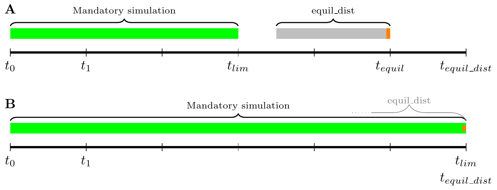
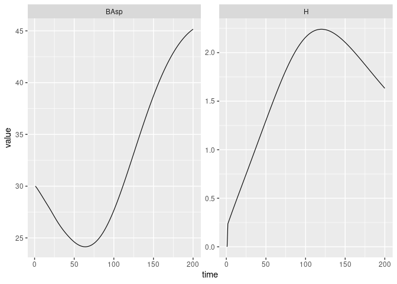
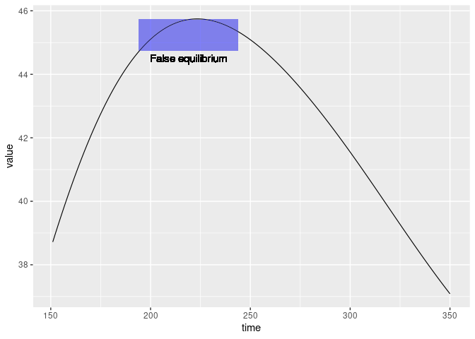

Basic functions and examples
================

This vignette illustrate the basic pipeline used to run simulations with
`{matreex}` package. The user can define different species of interest
to combine and use in a simulation. During those simulations, modules
can de triggered to test hypothesis and scenarii.

# Simulations input

## Define a species

Before simulating forest, we need first to define tree species in R.
Species regroups basic dynamic functions : growth, recruitment and
survival. To speed up computation, this package rely on **integrated
projection models** (later named IPM). To explain this principle
quickly, it is a matter of discretizing the dynamic functions into a
kernel that allows us to go from a size distribution at time t to the
distribution at time t+1.

To build this IPM for a species, we start from the fitted functions.
Theses functions depend on the size variable and climatic variables. The
data provided with the package comes from Kunstler et al.
([2021](#ref-kunstler2021)), and climatic variable are *sgdd* and *wai*.
.

An IPM is mostly defined by it’s mesh dimension, that are here
$700 \times 700$ between 90mm and `get_maxdbh(fit_Picea_abies) * 1.1` =
1204.5mm. This method is the same as in Kunstler et al.
([2021](#ref-kunstler2021)) and is used to limit eviction during
simulations.

**Please keep in mind this computation is intensive and may take few
minutes !**

``` r
library(matreex)
library(dplyr)
library(ggplot2)

# Load fitted model for a species
# fit_species # list of all species in dataset
data("fit_Picea_abies")

# Load associated climate
data("climate_species")
climate <- subset(climate_species, N == 2 & sp == "Picea_abies", select = -sp)
# see ?climate_species to understand the filtering of N.
climate
#>        sgdd       wai        sgddb      waib      wai2   sgdd2      PC1        PC2 N       SDM
#> 62 1444.667 0.4519387 0.0006922012 0.6887343 0.2042486 2087062 1.671498 0.02602064 2 0.6760556

Picea_ipm <- make_IPM(
    species = "Picea_abies", 
    climate = climate, 
    fit = fit_Picea_abies,
    clim_lab = "optimum clim", 
    mesh = c(m = 700, L = 90, U = get_maxdbh(fit_Picea_abies) * 1.1),
    BA = 0:60, # Default values are 0:200, smaller values speed up this vignette.
    verbose = TRUE
)
#> Launching integration loop
#> GL integration occur on 32 cells
#> midbin integration occur on 25 cells
#> Loop done.
#> Time difference of 32.5 secs
```

Once the IPM is integrated on a BA range, we can use it to build a
species upon it. This species will require few more function to works
during simulations :

-   `init_pop` : Function to draw the initial size distribution. The
    default one draw distribution for a basal area (later named BA) of 1
    with random functions. The package provide other function to draw
    random distribution at a selected BA (`def_initBA()`) or a given
    distribution (`def_init_k()`).

-   `harvest_fun` : Function that cut tree given the size distribution.
    The default function cut 0.6% of the trees regardless of their size
    at constant rate. Further functions allow to harvest according to
    Uneven and Even rules.

-   `disturb_fun` : Function that return tree mortality after a
    disturbance. The default one does not react to disturbance.

A species also comes few parameters, but they are only used for harvest
and disturbance modules.

For this example, we will just modify the initial size distribution to
start at a reasonable basal area.

``` r
Picea_sp <- species(IPM = Picea_ipm, init_pop = def_initBA(30))
```

## Define a forest

Once each species is set, we can assemble them in a `forest` object.
This scale also require to give additional parameters, but they are only
used for harvest and disturbance modules.

``` r
Picea_for <- forest(species = list(Picea = Picea_sp))
```

# Running simulations

Simulations will run until a given time limit is reached and can
continue further if an equilibrium is not reached. Another parameters is
the used surface `SurfEch`, and it’s define the surface of the studied
forest. This parameter is mainly here for historical purpose as models
were fitted on $300m^2$ plot, and output is scaled to an hectare.

To explain the time limit, below we simulate for 200 years and past this
time we continue the simulation until we reach an equilibrium on the
last 50 years (see figure A). This search for equilibrium will run until
the 300th year. If we want to register the full dynamic, we can set
`tlim = equil_time` with `equil_dist < tlim` (see figure B). **The
equilibrium is always the last size distribution** (shown in orange in
figure), and the simulation will detect it if the total variation of the
BA on `equil_dist` is inferior to 1 (parameter `equil_diff`).

<!-- -->

``` r
set.seed(42) # The seed is here for initial population random functions.
Picea_sim <- sim_deter_forest(
    Picea_for, 
    tlim = 200, 
    equil_time = 300, equil_dist = 50, equil_diff = 1,
    SurfEch = 0.03,
    verbose = TRUE
)
#> Starting while loop. Maximum t = 300
#> Simulation ended after time 244
#> BA stabilized at 45.30 with diff of 0.96 at time 244
#> Time difference of 1.28 secs
```

The output of a simulation is a data.frame in long format (according to
tidyverse style). This is very helpful to filter the output and plot it
with `{ggplot2}`.

``` r
Picea_sim  %>%
    dplyr::filter(var == "BAsp", ! equil) %>%
    ggplot(aes(x = time, y = value)) +
    geom_line(size = .4)
```

<!-- -->

If size distributions needs to be extracted, it can be easily done with
`{dplyr}` functions. The equilibrium step is associated with a logical
to extract it.

``` r
head(Picea_sim)
#> # A tibble: 6 × 7
#>   species     var    time  mesh  size equil value
#>   <chr>       <chr> <dbl> <dbl> <dbl> <lgl> <dbl>
#> 1 Picea_abies m         1     1  90.8 FALSE  0   
#> 2 Picea_abies m         2     1  90.8 FALSE  2.19
#> 3 Picea_abies m         3     1  90.8 FALSE  2.67
#> 4 Picea_abies m         4     1  90.8 FALSE  2.78
#> 5 Picea_abies m         5     1  90.8 FALSE  2.82
#> 6 Picea_abies m         6     1  90.8 FALSE  2.84

# get the maximum time
max_t <- max(Picea_sim$time)

# Filter example to extract the size distribution
Picea_sim %>% 
    dplyr::filter(grepl("m", var), time == max_t) %>% 
    dplyr::select(size, value)
#> # A tibble: 700 × 2
#>     size value
#>    <dbl> <dbl>
#>  1  90.8  1.25
#>  2  92.4  2.26
#>  3  94.0  2.01
#>  4  95.6  1.93
#>  5  97.2  1.85
#>  6  98.8  1.78
#>  7 100.   1.71
#>  8 102.   1.65
#>  9 104.   1.59
#> 10 105.   1.53
#> # … with 690 more rows
```

# Customizing the simulations

The above simulation is one of the simplest we can produce with this
package. This chapter will describe some basic customization we can add
before running a simulation.

## Initialisation step

By default, the initialization of the population run random process to
draw a size distribution for each species. We already show a function
(`def_initBA()`) that scale this distribution to a given basal area.
However, for a basal area value, multiple distribution are possible. To
control the exact distribution at start, we use `def_init_k()`. This
choice of starting distribution can be used to reproduce simulations,
starting from an equilibrium or a post disturbance state.

Here is an example where we start from $t = 150$ of the previous
simulation. This will illustrate that despite the simulation said it
reached equilibrium at time $t = 244$, our parameters have introduced a
bias. The previous equilibrium is highlighted in blue rectangle.

``` r
distrib_t150 <- Picea_sim %>% 
    dplyr::filter(grepl("m", var), time == 150) %>%
    dplyr::pull(value)
# NOTE : this distribution is given per ha and we need it for SurfEch = 0.03.
distrib_t150 <- distrib_t150 * 0.03

Picea_sp$init_pop <- def_init_k(distrib_t150)

Picea_sim_k <- sim_deter_forest(
    forest(species = list(Picea = Picea_sp)), 
    tlim = 200, 
    equil_time = 300, equil_dist = 50,
    SurfEch = 0.03,
    verbose = TRUE
)
#> Starting while loop. Maximum t = 300
#> Simulation ended after time 282
#> BA stabilized at 34.10 with diff of 0.96 at time 282
#> Time difference of 1.43 secs

Picea_sim_k  %>%
    dplyr::filter(var == "BAsp", ! equil) %>%
    # below, we keep the time reference of the previous simulation 
    # to simplify the understanding of the full document.
    dplyr::mutate(time = time + 150) %>% 
    ggplot(aes(x = time, y = value)) +
    geom_line(size = .4) +
    geom_rect(mapping = aes(xmin = 194, xmax = 244, 
                                     ymin = max(value-1), ymax = max(value)),
                       alpha = 0.002, fill = "blue") +
    geom_text(aes(label = "False equilibrium", x = 219, y = 44.5), size = 4) 
```

<!-- -->

## Multiple species

Multi-specific simulations are performed like the simulations previously
illustrated. The only difference is in the construction of the forest
object. This explain why the `species` argument for `forest()` function
require a list for input.

We need to modelise a second species. Be careful to select the same
climate as the first species.

``` r
data("fit_Abies_alba")

Abies_ipm <- make_IPM(
    species = "Abies_alba", 
    climate = climate, # this variable is defined at the top of the doc.
    fit = fit_Abies_alba,
    clim_lab = "optimum clim",
    mesh = c(m = 700, L = 90, U = get_maxdbh(fit_Abies_alba) * 1.1),
    BA = 0:60, # Default values are 0:200, smaller values speed up this vignette.
    verbose = TRUE
)
#> Launching integration loop
#> GL integration occur on 24 cells
#> midbin integration occur on 25 cells
#> Loop done.
#> Time difference of 22.2 secs
Abies_sp <- species(IPM = Abies_ipm, init_pop = def_initBA(35))
```

``` r
# We edit back the init_fun for Picea
Picea_sp$init_pop <- def_initBA(15)
Picea_Abies_for <- forest(species = list(Picea = Picea_sp, Abies = Abies_sp))

set.seed(42)
Picea_Abies_sim <- sim_deter_forest(
    Picea_Abies_for, 
    tlim = 500, 
    equil_time = 500, equil_dist = 50,
    SurfEch = 0.03,
    verbose = TRUE
)
#> Starting while loop. Maximum t = 500
#> time 500 | BA diff : 0.08
#> Simulation ended after time 500
#> BA stabilized at 50.79 with diff of 0.08 at time 500
#> Time difference of 4.33 secs

Picea_Abies_sim  %>%
    dplyr::filter(var == "BAsp", ! equil) %>%
    ggplot(aes(x = time, y = value, color = species)) +
    geom_line(size = .4)
```

<!-- -->

# References

<div id="refs" class="references csl-bib-body hanging-indent">

<div id="ref-kunstler2021" class="csl-entry">

Kunstler, Georges, Arnaud Guyennon, Sophia Ratcliffe, Nadja Rüger,
Paloma Ruiz-Benito, Dylan Z. Childs, Jonas Dahlgren, et al. 2021.
“Demographic Performance of European Tree Species at Their Hot and Cold
Climatic Edges.” *Journal of Ecology* 109 (2): 1041–54.
<https://doi.org/10.1111/1365-2745.13533>.

</div>

</div>
