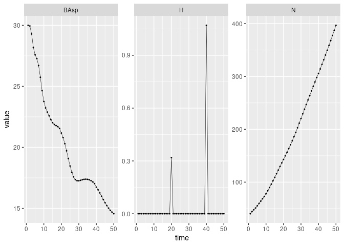

Harvesting models
================

This vignette illustrate how to use harvesting scenarii with `{matreex}`
package. An harvesting scenario is a simulation modification that will
trigger some additional death in defined size distribution. This
distribution is differenciated from base mortality and is saved and
exported for each simulation.

This document will skip the usage of basic function that are shown in [a
previous introduction vignette](matreex.html).

# Simulations input

## Define a species

The first step of IPM integration. This part is common with basic usage
of the package so nothing is very important here.

**Please keep in mind this computation is intensive and may take few
minutes !**

``` r
library(matreex)
library(dplyr)
library(ggplot2)

# Load fitted model for a species
# fit_species # list of all species in dataset
data("fit_Picea_abies")

# Load associated climate
data("climate_species")
climate <- subset(climate_species, N == 2 & sp == "Picea_abies", select = -sp)
# see ?climate_species to understand the filtering of N.
climate
#>        sgdd       wai        sgddb      waib      wai2   sgdd2      PC1        PC2 N       SDM
#> 62 1444.667 0.4519387 0.0006922012 0.6887343 0.2042486 2087062 1.671498 0.02602064 2 0.6760556

Picea_ipm <- make_IPM(
    species = "Picea_abies", 
    climate = climate, 
    fit = fit_Picea_abies,
    clim_lab = "optimum clim", 
    mesh = c(m = 700, L = 90, U = get_maxdbh(fit_Picea_abies) * 1.1),
    BA = 0:50, # Default values are 0:200, smaller values speed up this vignette.
    verbose = TRUE
)
#> Launching integration loop
#> GL integration occur on 32 cells
#> midbin integration occur on 25 cells
#> Loop done.
#> Time difference of 27.8 secs
```

Harvesting rules have different scales : some rules are defined for each
species, others at the forest level and lastly input parameters when
launching simulation. These rules can always be defined but will only be
used when the correct module is triggered by simulations. The table
below summarise the required parameters for each scenario. Each scenario
have an example in the following document.

| Harvesting scenario       | Species function                     | Species parameters | Forest parameters                | Simulation parameters       |
|---------------------------|--------------------------------------|--------------------|----------------------------------|-----------------------------|
| default                   | `def_harv()` <br> or custom by user. | $\emptyset$        | `harv_rules["freq"]`             | $\emptyset$                 |
| Uneven                    | `Uneven_harv()`                      | `harv_lim`         | `harv_rules`                     | `targetBA`                  |
| Even <br> *in active dev* | `Even_harv()`                        | `rdi_coef`         | `harv_rules` <!--`FinalHarvT`--> | `targetRDI` <br> `targetKg` |

Short example : When using an Uneven scenario, each species needs to use
the `Uneven_harv()` function with `harv_lim` parameters. The forest will
need to have `harv_rules` parameters. The `sim_deter_forest()` require
`targetBA` argument. If `targetRDI` is defined, it will not be used.

In multi-specific simulation, it is possible to combine Uneven or Even
managed species with default species.

| species 1 | species 2 | Harvesting scenario to use |
|-----------|-----------|----------------------------|
| default   | default   | default                    |
| Uneven    | default   | Uneven                     |
| Even      | default   | Even                       |
| Uneven    | Even      | **Not possible !**         |

# Default scenario

## Presentation

The default scenario is based on Kunstler et al.
([2021](#ref-kunstler2021)). This mean there is a constant harvest rate
triggered each year. This harvest rate is uniform on the distribution.
This is the scenario used when no modification is given.

This rate is coded in `def_harv()` function as shown below and the
frequency (each year) is given in `harv_rules["freq"]`. Note that the
rate only impact all size classes except classes used in delay (with
`* (ct > 0)`).

``` r
def_harv
#> function(x, species, ...){
#> 
#>     dots <- list(...)
#>     ct <- dots$ct
#> 
#>     rate <- 0.006 * (ct > 0)
#>     return(x * rate)
#> }
#> <bytecode: 0x562c6a0a8c38>
#> <environment: namespace:matreex>
Picea_sp <- species(IPM = Picea_ipm,init_pop = def_initBA(30))
Picea_for <- forest(species = list(Picea = Picea_sp), 
                      harv_rules = c(Pmax = 0.25, dBAmin = 3, 
                                     freq = 1, alpha = 1))
```

With this scenario, the simulation can be launched without any
additional parameter.

``` r
set.seed(42) # The seed is here for initial population random functions.
Picea_sim <- sim_deter_forest(
    Picea_for,
    tlim = 200,
    equil_time = 200, equil_dist = 10, equil_diff = 1,
    SurfEch = 0.03,
    verbose = TRUE
)
#> Starting while loop. Maximum t = 200
#> Simulation ended after time 200
#> BA stabilized at 45.16 with diff of 0.69 at time 200
#> Time difference of 0.781 secs
```

Once the simulation is done, we can extract the basal area and the
number of individual at each step of the simulation. The new variable we
can look now is $H$, the sum of harvest distribution at each step. This
distribution is also exported with an harvest value for each mesh cell
$h_i$.

In this case, $H$ is correlated with $N$ since it’s a constant
percentage not linked with a size distribution. The first step being the
initialisation step, it’s normal to have no harvest.

``` r
Picea_sim  %>%
    dplyr::filter(var %in% c("BAsp", "N", "H"), ! equil) %>%
    ggplot(aes(x = time, y = value)) +
    facet_wrap(~ var, scales = "free_y") +
    geom_line(size = .2) + geom_point(size = 0.4) 
```

<!-- -->

## Modulation

This section will just illustrate variation of the default scenario.
First we modify the frequency of the harvest. When the harvest is not
triggered, the value returned is 0.

``` r
set.seed(42) # The seed is here for initial population random functions.
Picea_sim_f20 <- sim_deter_forest(
    forest(species = list(Picea = Picea_sp), 
                      harv_rules = c(Pmax = 0.25, dBAmin = 3, 
                                     freq = 20, alpha = 1)),
    tlim = 50,
    equil_time = 50, equil_dist = 10, equil_diff = 1,
    SurfEch = 0.03,
    verbose = TRUE
)
#> Starting while loop. Maximum t = 50
#> Simulation ended after time 50
#> BA stabilized at 30.14 with diff of 0.02 at time 50
#> Time difference of 0.448 secs
Picea_sim_f20  %>%
    dplyr::filter(var %in% c("BAsp", "N", "H"), ! equil) %>%
    ggplot(aes(x = time, y = value)) +
    facet_wrap(~ var, scales = "free_y") +
    geom_line(size = .2) + geom_point(size = 0.4) 
```

<!-- --> A more advanced
step consist in modification of the harvest function for more custom
effects. Obviously, this kind of modification is more prone to error so
don’t hesitate to contact `{matreex}` maintainer. For example, this is
function where we multiply a constant rate with the mesh, meaning that
the larger the tree get, the more we its size class.

``` r
Picea_harv <- Picea_sp
Picea_harv$harvest_fun <- function(x, species, ...){

    dots <- list(...)
    ct <- dots$ct

    rate <- 6e-4 * (ct > 0) * species$IPM$mesh 
    return(x * rate)
}

set.seed(42) # The seed is here for initial population random functions.
Picea_sim_f20 <- sim_deter_forest(
    forest(species = list(Picea = Picea_harv), 
                      harv_rules = c(Pmax = 0.25, dBAmin = 3, 
                                     freq = 20, alpha = 1)),
    tlim = 250,
    equil_time = 250, equil_dist = 10, equil_diff = 1,
    SurfEch = 0.03,
    verbose = TRUE
)
#> Starting while loop. Maximum t = 250
#> Simulation ended after time 250
#> BA stabilized at 25.86 with diff of 5.25 at time 250
#> Time difference of 1.23 secs
Picea_sim_f20  %>%
    dplyr::filter(var %in% c("BAsp", "N", "H"), ! equil) %>%
    ggplot(aes(x = time, y = value)) +
    facet_wrap(~ var, scales = "free_y") +
    geom_line(size = .2) + geom_point(size = 0.4) 
```

<!-- -->

<!-- # Uneven scenario -->
<!-- Uneven harvest scenario consist in harvesting tree depending on the basal area of the stand and the distribution of the tree sizes.  -->
<!-- # Even scenario -->
<!-- $$ -->
<!-- dg = \sqrt{\frac{\sum_{i = 0}^n d_i^2 x_i}{ \sum_{i = 0}^n x_i }} \\ -->
<!-- dg_{cut} = \sqrt{\frac{\sum_{i = 0}^n d_i^2 x_i Pc_i }{ \sum_{i = 0}^n x_i Pc_i }} -->
<!-- $$ -->
<!-- mesh in cm. -->
<!-- $$ -->
<!-- RDI = \frac{ \sum_{i = 0}^n x_i }{ e^{ RDI_{int} + RDI_{slope} \times \frac{ \log( \frac{ \sum_{i = 0}^n mesh_i^2  x_i }{ \sum_{i = 0}^n x_i} ) }{2}   } } -->
<!-- $$ -->

<div id="refs" class="references csl-bib-body hanging-indent">

<div id="ref-kunstler2021" class="csl-entry">

Kunstler, Georges, Arnaud Guyennon, Sophia Ratcliffe, Nadja Rüger,
Paloma Ruiz-Benito, Dylan Z. Childs, Jonas Dahlgren, et al. 2021.
“Demographic Performance of European Tree Species at Their Hot and Cold
Climatic Edges.” *Journal of Ecology* 109 (2): 1041–54.
<https://doi.org/10.1111/1365-2745.13533>.

</div>

</div>
