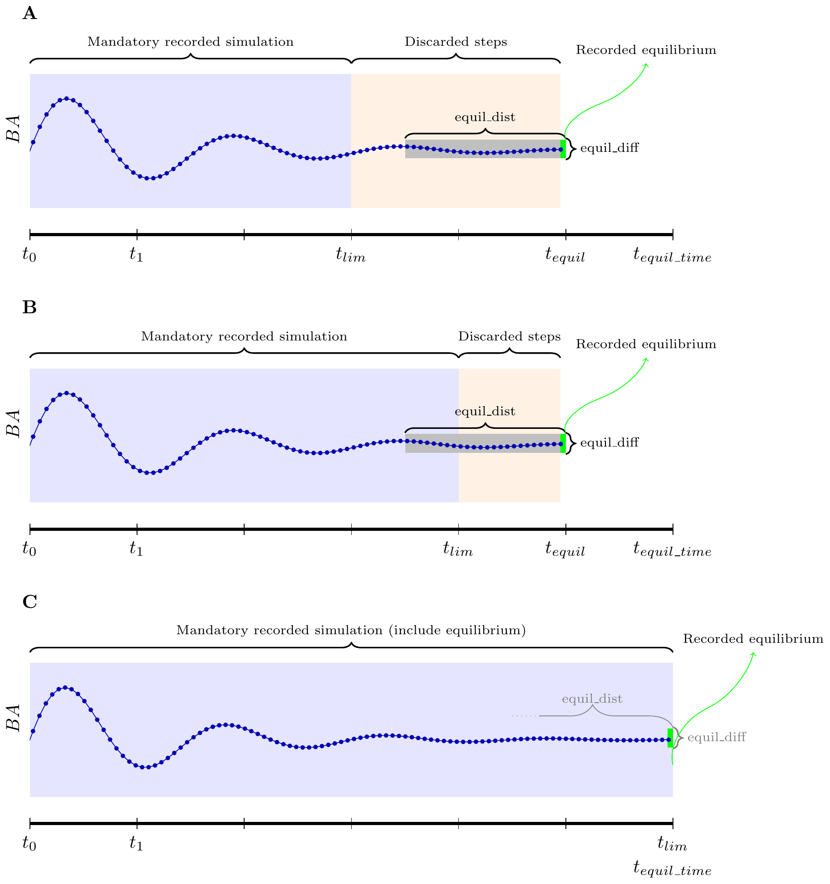
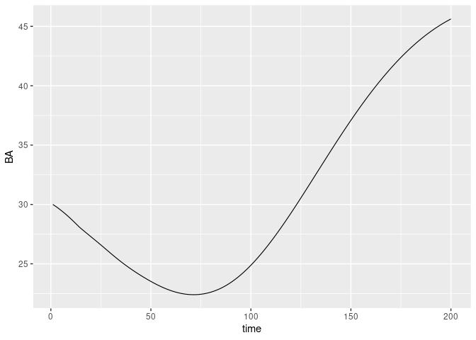
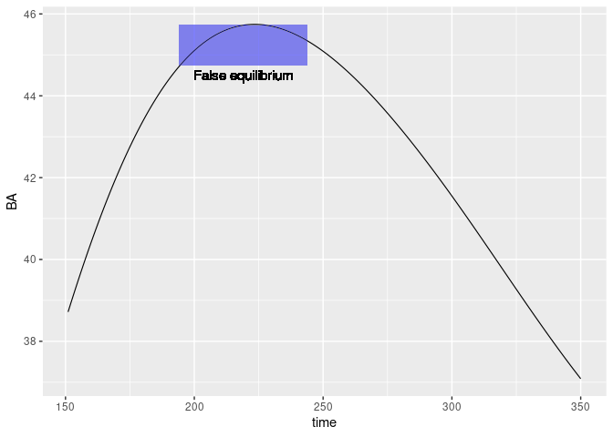
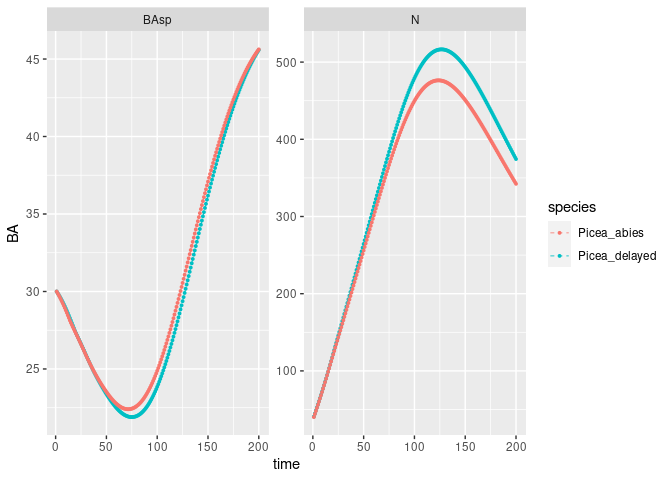
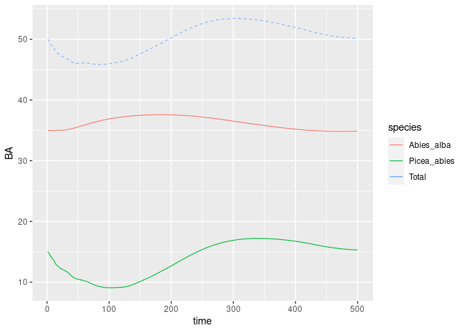
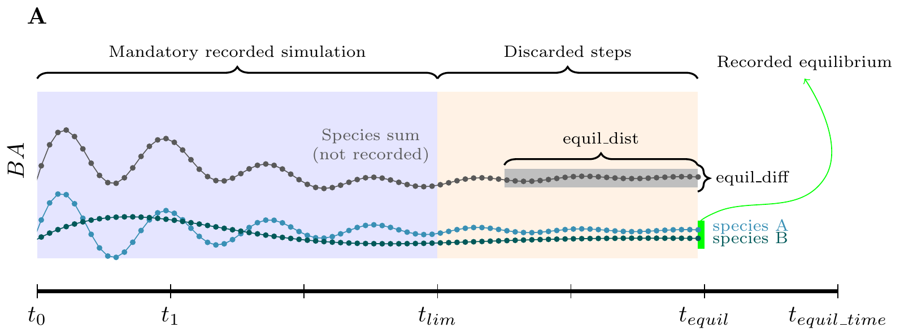

Basic functions and examples
================

<style>
body {
text-align: justify}
</style>

This vignette illustrates the basic functions used to run simulations
projecting the population of size-structured trees with `{matreex}`
package. The package can model the dynamic of monospecific or
plurispecific tree communities. Different modules allow also to simulate
harvesting and disturbances. To project forward the dynamic of
size-structured tree populations, this package relies on **integrated
projection models** (later named IPM).

# Rapid description of the Integral Projection Model

Details on the fitting and the integration of IPM model can be found in
Ellner, Childs, and Rees ([2016](#ref-ellner2016)). Briefly, an IPM
predicts the size distribution, $n(z', t+1)$, of a population at time
t+1 from its size distribution at time t, $n(z, t)$, with $z$ the size
at t and $z'$ the size at $t + 1$, based on the following equation
(Ellner, Childs, and Rees ([2016](#ref-ellner2016))):

$$
n(z', t+1) = \int_{L}^{U} K(z', z) n(z, t) dz 
$$

with $L$ and $U$ being, respectively, the lower and upper observed sizes
for integration of the kernel $K$.

The kernel $K(z' ,z)$ can be split into the survival and growth kernel
$P(z' ,z)$ and the fecundity kernel $F(z', z)$, as follows :
$K(z' ,z) = P(z' ,z) + F(z' ,z)$ .

The fecundity kernel $F(z', z)$ gives the size distribution of newly
recruited trees at time $t+1$ as a function of the size distribution at
time t. The survival and growth kernel $P(z', z)$ is defined as
$P(z', z) = s(z) \times G(z', z)$, $s$ being the survival function and
$G$ the growth function. The kernel $K(z' ,z)$, thus, integrate the
three key vital rates functions: growth, survival, and recruitment. The
kernel $P$ is numerically approximated with a big iteration matrix and
the continuous size distribution $n$ is approximated by a big state
vector. The dimension and the width of the size class are selected to
ensure a good numerical integration of the kernel $P$. Details on the
numerical integration are given below and in Kunstler et al.
([2021](#ref-kunstler2021)) and Guyennon et al.
([2023](#ref-guyennon2023)) .
<!--The figure 1 presents the structure and approach of the IPM. -->
Note, that this package do not cover the statistical fitting of the
vital rates functions.

# Simulations input

## Define a species

Before simulating forest, we need first to define tree species in R.
Species regroups basic vital rates functions: growth, recruitment and
survival. In this package, we provide the fitted vital rates functions
used in Kunstler et al. ([2021](#ref-kunstler2021)) and Guyennon et al.
([2023](#ref-guyennon2023)) . These functions depend on tree size, local
competition based on the sum of basal area of competitors, and two
climatic variables. The climatic variables are the sum of the sum of
growing degree days *sgdd*, the water aridity index *wai* (see Kunstler
et al. ([2021](#ref-kunstler2021)) for more details). Kunstler et al.
([2021](#ref-kunstler2021)) and Guyennon et al.
([2023](#ref-guyennon2023)) used a resampling procedure to estimate the
vital rates functions resulting in 100 resampled estimate of the
parameters of each functions, here to simplify the simulations we
provide only the averaged parameters over those 100 resamples. It is
however, in theory, possible to run simulations with other vital rates
functions if they are provided as glm objects (please contact the
authors to test new variables).

To build an IPM for a species we start from fitted function Kunstler et
al. ([2021](#ref-kunstler2021)) and Guyennon et al.
([2023](#ref-guyennon2023)) . To do the numerical integration of $P$, we
need to define the mesh dimension, here $700$, the lower $L$ and upper
limits $U$, here respectively 90mm and
`get_maxdbh(fit_Picea_abies) * 1.1` = 1204.5mm, and range of value of
competition index BA (here from 0 to 60 $m^2/ha$). These are the values
used in Kunstler et al. ([2021](#ref-kunstler2021)) and Guyennon et al.
([2023](#ref-guyennon2023)) that were optimized to provide good
numerical integration.

**Please keep in mind this computation is intensive and may take few
minutes!**

``` r
library(matreex)
library(dplyr)
library(ggplot2)

# Load fitted model for a species
# fit_species # list of all species in dataset
data("fit_Picea_abies")

# Load associated climate
data("climate_species")
climate <- subset(climate_species, N == 2 & sp == "Picea_abies", select = -sp)
# N here is a climate defined in Kunstler et al 2021. 
# N == 2 is the optimum climate for the species. 
# see ?climate_species for more info.
climate
#>        sgdd       wai        sgddb      waib      wai2   sgdd2      PC1        PC2 N
#> 62 1444.667 0.4519387 0.0006922012 0.6887343 0.2042486 2087062 1.671498 0.02602064 2
#>          SDM
#> 62 0.6760556

Picea_ipm <- make_IPM(
    species = "Picea_abies", 
    climate = climate, 
    fit = fit_Picea_abies,
    clim_lab = "optimum clim", 
    mesh = c(m = 700, L = 90, U = get_maxdbh(fit_Picea_abies) * 1.1),
    BA = 0:60, # Default values are 0:200, smaller values speed up this vignette.
    verbose = TRUE
)
#> Launching integration loop
#> GL integration occur on 32 cells
#> midbin integration occur on 25 cells
#> Loop done.
#> Time difference of 40.9 secs
```

Once the IPM is integrated on a BA range, we can use it to build a
species object. In R, a species is a list object that is constructed
with the `species()` function. In addition to the IPM kernel $P$, this
list require few more functions to work during simulations :

-   `init_pop` : Function to draw the initial size distribution. The
    default one draw distribution for a basal area (later named BA) of 1
    $m^2/ha$ with random functions (see the help of the function for
    more details). The package provide other functions to draw random
    distribution at a selected BA (`def_initBA()`) or a given
    distribution (`def_init_k()`).

-   `harvest_fun` : Function that cut tree given the size distribution.
    The default function cut 0.6% per year of the trees regardless of
    their size. Further functions allow to harvest according to Uneven
    and Even rules (see Harvesting Vignette).

-   `disturb_fun` : Function that return tree mortality after a
    disturbance. The default is no disturbance.

A species also comes with few parameters, but they are only used for
harvest and disturbance modules.

For this example, we will just modify the initial size distribution to
start at a basal area of 30 $m^2/ha$.

``` r
Picea_sp <- species(IPM = Picea_ipm, init_pop = def_initBA(30))
```

## Define a forest

Once each species objects are built, we can assemble them in a `forest`
object. This function also require additional parameters, but they are
only used for harvest and disturbance modules.

``` r
Picea_for <- forest(species = list(Picea = Picea_sp))
```

# Running simulations

A simulations project forward a size-structured population from its
initial state with the matrix kernel $P$ and the recruitment function.
This function requires the length of the simulation and the time limit
to search for an equilibrium. A simulation is run until the time limit
is reached and can continue further if an equilibrium is not reached.
Another parameter is the simulated surface `SurfEch`, it’s define the
surface of the studied forest. This parameter is mainly here for
historical purpose as models were fitted on $300m^2$ plot, and output is
scaled to one hectare.

``` r
set.seed(42) # The seed is here for initial population random functions.
Picea_sim <- sim_deter_forest(
    Picea_for, 
    tlim = 200, 
    equil_time = 300, equil_dist = 50, equil_diff = 1,
    SurfEch = 0.03,
    verbose = TRUE
)
#> Starting while loop. Maximum t = 300
#> Simulation ended after time 224
#> BA stabilized at 51.80 with diff of 0.94 at time 224
#> Time difference of 1.07 secs
```

In the code above, we simulate for 200 years (`tlim`) years and past
this time we continue the simulation till it reach an equilibrium up to
300 years (see figure A). After `tlim`, the simulation will continue
until the population reach an equilibrium up to a maximum of 300 year
(`equil_time`) .

The criteria for reaching an equilibrium (in green) is based on
computing the range of variation of BA for a moving window of length
`equil_dist` since the current step (in grey). The equilibrium is
reached if the range of variation within this moving window is less than
`equil_diff`. The equilibrium is reached at the first timestep for which
the basal area range is lower than `equil_diff`. The steps between
`tlim` and `t_equil` are not recorded. The search for the equilibrium
start at `tlim` over the last `equil_dist` steps (see figure B). This is
why `equil_dist` must not be higher than `tlim`. If we want to register
the full dynamic, we can set `tlim = equil_time` (see figure C). **The
equilibrium is always the last size distribution** (shown in green in
figure). Note that in this case, the final distribution will be returned
in the result twice. The `equil_dist` and `equil_diff` parameters are
not important in this case.

<!-- -->

Keep in mind that despite high `tlim` and `equil_time` values, the
equilibrium may not be reached at the end of the simulation. There is
currently no way in the algorithm to report this to the user. The best
way to detect “false equilibrium” is when the last step takes place at
`t == equil_time` and by plotting the basal area along time. These cases
are illustrated in figure D and E.

Also, this equilibrium is only computed on total basal area, and the
distribution can change. We welcome any suggestions you may have
regarding the equilibrium definition.

<!-- -->

The output of a simulation is a data.frame in long format (according to
tidyverse style). This is very helpful to filter the output and plot it
with `{ggplot2}`. Variables exported are the basal area per species
`BAsp`, `n` and `h`the number of alive and harvested individuals per
mesh, and `N` and `H` the total number of alive and harvested
individuals in the forest (per hectar).

``` r
Picea_sim  %>%
    dplyr::filter(var == "BAsp", ! equil) %>%
    ggplot(aes(x = time, y = value)) +
    geom_line(linewidth = .4) + ylab("BA")
```

<!-- -->

If size distributions needs to be extracted, it can be easily done with
`{dplyr}` functions. The equilibrium step is associated with a logical
variable to extract it.

``` r
head(Picea_sim)
#> # A tibble: 6 × 7
#>   species     var    time  mesh  size equil value
#>   <chr>       <chr> <dbl> <dbl> <dbl> <lgl> <dbl>
#> 1 Picea_abies n         1     1     0 FALSE  0   
#> 2 Picea_abies n         2     1     0 FALSE  2.19
#> 3 Picea_abies n         3     1     0 FALSE  2.22
#> 4 Picea_abies n         4     1     0 FALSE  2.34
#> 5 Picea_abies n         5     1     0 FALSE  2.53
#> 6 Picea_abies n         6     1     0 FALSE  2.65

# get the maximum time
max_t <- max(Picea_sim$time)

# Filter example to extract the size distribution
Picea_sim %>% 
    dplyr::filter(grepl("m", var), time == max_t) %>% 
    dplyr::select(size, value)
#> # A tibble: 0 × 2
#> # … with 2 variables: size <dbl>, value <dbl>
```

# Customizing the simulations

The above simulation is one of the simplest we can produce with this
package. This chapter will describe some basic customization we can add
before running a simulation.

## Initialisation step

By default, the initialization of the population run random process to
draw a size distribution for each species. We already show a function
(`def_initBA()`) that scale this distribution to a given basal area.
However, for a basal area value, multiple distribution are possible. To
control the exact distribution at start, we use `def_init_k()`. This
choice of starting distribution can be used to reproduce simulations,
starting from an equilibrium or a post disturbance state.

Here is an example where we start from $t = 150$ of the previous
simulation. This will illustrate that despite the simulation said it
reached equilibrium at time $t =$ 224244, our parameters have introduced
failed to identify the true equilibrium. The previous equilibrium is
highlighted in blue rectangle.

``` r
# extract distribution
distrib_t150 <- Picea_sim %>% 
    dplyr::filter(var == "n", time == 150) %>%
    dplyr::pull(value)
# NOTE : this distribution is given per ha and we need it for SurfEch = 0.03.
distrib_t150 <- distrib_t150 * 0.03

Picea_sp$init_pop <- def_init_k(distrib_t150)

Picea_sim_k <- sim_deter_forest(
    forest(species = list(Picea = Picea_sp)), 
    tlim = 200, 
    equil_time = 300, equil_dist = 50,
    SurfEch = 0.03,
    verbose = TRUE
)
#> Starting while loop. Maximum t = 300
#> Simulation ended after time 300
#> BA stabilized at 28.21 with diff of 3.47 at time 300
#> Time difference of 1.4 secs

Picea_sim_k  %>%
    dplyr::filter(var == "BAsp", ! equil) %>%
    # below, we keep the time reference of the previous simulation 
    # to simplify the understanding of the full document.
    dplyr::mutate(time = time + 150) %>% 
    ggplot(aes(x = time, y = value)) +
    geom_line(linewidth = .4) + ylab("BA") +
    geom_rect(mapping = aes(xmin = prev_equil - 50, xmax = prev_equil, 
                                     ymin = max(value-1), ymax = max(value)),
                       alpha = 0.002, fill = "blue") +
    geom_text(aes(label = "False equilibrium", 
                  x = prev_equil - 25, y = max(value) - 3), size = 4) 
```

<!-- -->

## Recruitment delay

New trees are recruited at $L$ (90mm). Trees takes however several years
to grow from seed to the minimum size $L$. To represents the time lag
for a tree to recruit up to $L$, we can modify a species by adding a
delay for recruitment of new individuals. By default, the recruitment is
a given number of new individuals. This number is split in half and adds
to the first two class of size distribution. Adding delay expand the IPM
with `n_delay` age based classes to represent the year its takes (here 5
years) to grow up to $L$. The new recruit will age from one age class to
another until they enter the size-based IPM.

A default delay is used by `build_IPM()` for each species. These values
are computed from regressions.

``` r
n_delay <- 5
Picea_sp_d5 <- delay(Picea_sp, n_delay)
Picea_sp_d5$info["species"] <- "Picea_delayed" # We rename the species for easier plot.
Picea_sp_d5$init_pop <- def_initBA(30)
```

The simulation is run in the same way as the delay is only defined at
the IPM level.

``` r
set.seed(42)
Picea_sim_d5 <- sim_deter_forest(
    forest(species = list(Picea = Picea_sp_d5)),
    tlim = 200, 
    equil_time = 200, equil_dist = 50,
    SurfEch = 0.03,
    verbose = TRUE
)
#> Starting while loop. Maximum t = 200
#> Simulation ended after time 200
#> BA stabilized at 53.13 with diff of 5.71 at time 200
#> Time difference of 0.954 secs
```

Equilibrium BA should be really close with or without delay
($\Delta_{BA} < 1$). N is expected to increase with delay since delayed
mesh cell with seeds are counted in.

``` r
Picea_sim_d5 %>%
    rbind(Picea_sim) %>%
    dplyr::filter(var %in% c("BAsp", "N"), !equil) %>%
    ggplot(aes(x = time, y = value, color = species)) +
    geom_line(linetype = "dashed", linewidth = .3) +
    geom_point(size = .7) + ylab("BA") +
    facet_wrap(~ var, scales = "free_y") +
    NULL
```

<!-- -->

<!-- Despite a really close BA, the size distribution is different at equilibrium. -->
<!-- *Note : Values below the redline does not count in BA computation.* -->

## Multiple species

Multi-specific simulations are performed like the simulations previously
illustrated. The only difference is in the construction of the forest
object. This explain why the `species` argument for `forest()` function
require a list for input.

We need to modelise a second species. Be careful to select the same
climate as the first species.

``` r
data("fit_Abies_alba")

Abies_ipm <- make_IPM(
    species = "Abies_alba", 
    climate = climate, # this variable is defined at the top of the doc.
    fit = fit_Abies_alba,
    clim_lab = "optimum clim",
    mesh = c(m = 700, L = 90, U = get_maxdbh(fit_Abies_alba) * 1.1),
    BA = 0:60, # Default values are 0:200, smaller values speed up this vignette.
    verbose = TRUE
)
#> Launching integration loop
#> GL integration occur on 24 cells
#> midbin integration occur on 25 cells
#> Loop done.
#> Time difference of 24.7 secs
Abies_sp <- species(IPM = Abies_ipm, init_pop = def_initBA(35))
```

``` r
# We edit back the init_fun for Picea
Picea_sp$init_pop <- def_initBA(15)
Picea_Abies_for <- forest(species = list(Picea = Picea_sp, Abies = Abies_sp))

set.seed(42)
Picea_Abies_sim <- sim_deter_forest(
    Picea_Abies_for, 
    tlim = 500, 
    equil_time = 500, equil_dist = 50,
    SurfEch = 0.03,
    verbose = TRUE
)
#> Starting while loop. Maximum t = 500
#> time 500 | BA diff : 0.80
#> Simulation ended after time 500
#> BA stabilized at 48.58 with diff of 0.80 at time 500
#> Time difference of 4.66 secs

Picea_Abies_sim  %>%
    dplyr::filter(var == "BAsp", ! equil) %>%
    ggplot(aes(x = time, y = value, color = species)) +
    geom_line(linewidth = .4) + ylab("BA") +
    stat_summary(fun = "sum",  aes(col="Total"),
                 geom ='line', linetype = "dashed", linewidth = .3)
```

<!-- -->

An important point to note for multiple species is that the equilibrium
is defined at the forest level, that is the sum of species basal area.

<!-- -->

# References

<div id="refs" class="references csl-bib-body hanging-indent">

<div id="ref-ellner2016" class="csl-entry">

Ellner, Stephen P., Dylan Z. Childs, and Mark Rees. 2016. *Data-Driven
Modelling of Structured Populations: A Practical Guide to the Integral
Projection Model*. Lecture Notes on Mathematical Modelling in the Life
Sciences. Cham: Springer International Publishing.
<https://doi.org/10.1007/978-3-319-28893-2>.

</div>

<div id="ref-guyennon2023" class="csl-entry">

Guyennon, Arnaud, Björn Reineking, Roberto Salguero-Gomez, Jonas
Dahlgren, Aleksi Lehtonen, Sophia Ratcliffe, Paloma Ruiz-Benito, Miguel
A. Zavala, and Georges Kunstler. 2023. “Beyond Mean Fitness: Demographic
Stochasticity and Resilience Matter at Tree Species Climatic Edges.”
*Global Ecology and Biogeography* n/a (n/a).
https://doi.org/<https://doi.org/10.1111/geb.13640>.

</div>

<div id="ref-kunstler2021" class="csl-entry">

Kunstler, Georges, Arnaud Guyennon, Sophia Ratcliffe, Nadja Rüger,
Paloma Ruiz-Benito, Dylan Z. Childs, Jonas Dahlgren, et al. 2021.
“Demographic Performance of European Tree Species at Their Hot and Cold
Climatic Edges.” *Journal of Ecology* 109 (2): 1041–54.
<https://doi.org/10.1111/1365-2745.13533>.

</div>

</div>
