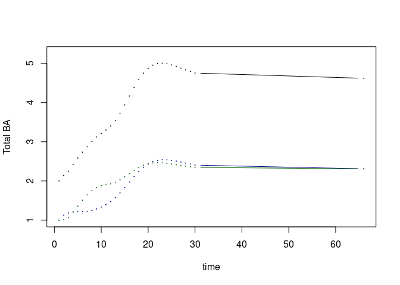
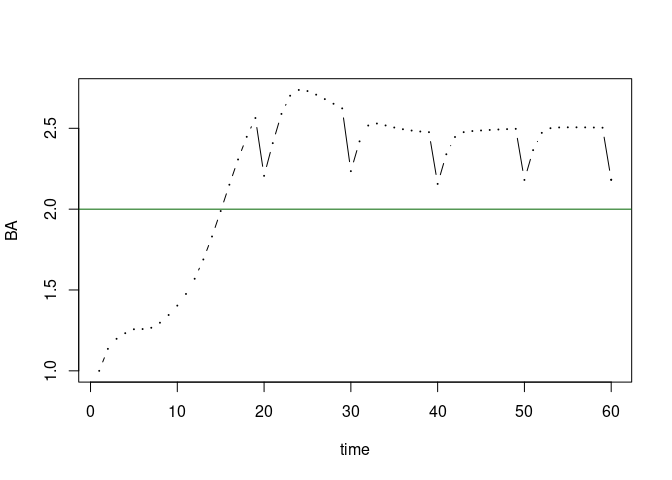
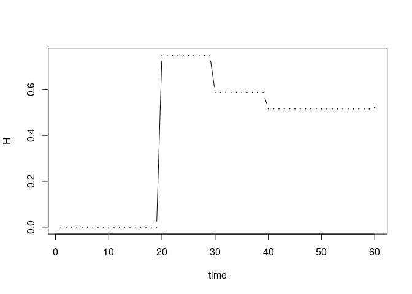
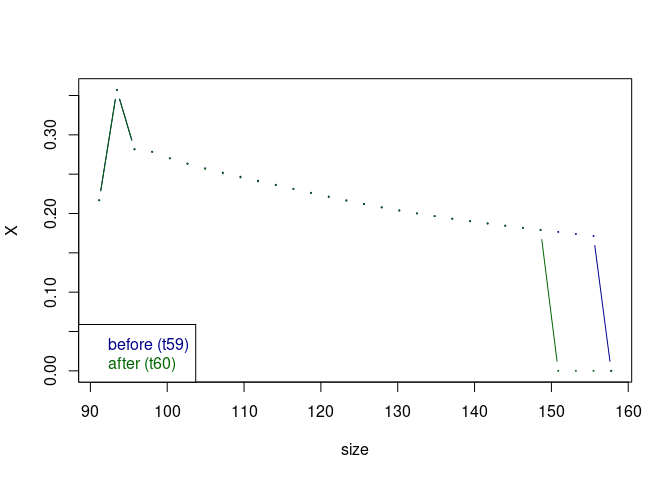
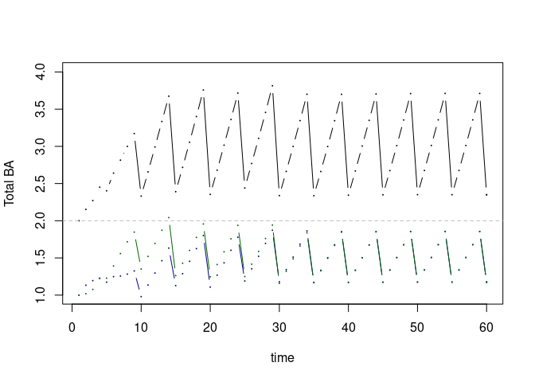

Running multi species deterministic simulations
================

``` r
library(treeforce)
```

# Introduction

Simulation run on the Forest class object, that contains all elements.
It’s composed of *n* species. Each species is defined by multiples
functions :

-   init_pop is the function to initiate the population at time 1.
-   recruit_fun is the function that depend on the total basal area.
-   harvest_fun is the function that return the harvested population
    that should be subtracted to the population at time t.
-   IPM is the list of integrated matrices for several basal area.

# Loading previous work IPM

Functions are defined to load the previous IPM saved as *.Rds*. The
files must located in specific directory format which is :

**`path/output/species/IPM_Clim_X.Rds`**

Once the files are in place, the code below allow to create the species
of interest. One last argument is *replicat* which select one of the 100
simulations of previous work. **A mean IPM should replace this later**.

Default functions of initialization and harvest are used. You can write
your own functions as long as they use the same arguments. Try to write
function that don’t initialize negative populations.

Example data set is a cropped IPM with a mesh of length 30 with BA from
1 to 10.

``` r
spe <- "Yggdrasil" # Example dataset given with the package
# Warning, loading an old IPM takes around 10s
Yggdrasil <- old_ipm2species(
    spe, climatic = 1, replicat = 1,
    path = system.file("extdata", package = "treeforce", mustWork = TRUE),
)
def_init
#> function(mesh, SurfEch = 0.03) {
#>     ct <- drop(Buildct(mesh = mesh, SurfEch = SurfEch))
#>     ini <- exp(runif(1, -.005, .005) * mesh)
#>     alea <- rbinom(length(mesh), 1, runif(1, .6, .9)) == 1
#>     while(all(alea)){ # because god knows it's fucking possible.
#>                       # and it will return NaN
#>         alea <- rbinom(length(mesh), 1, runif(1, .6, .9)) == 1
#>     }
#>     ini[alea] <- 0
#>     res <- as.numeric(ini / sum(ct * ini) )
#>     res <- res + 1e-10 # HACK to limit falling in floating point trap !
#> 
#>     return(res)
#> }
#> <environment: namespace:treeforce>
```

A forest is just a list of the species. **Later it will also require
harvest rules with target BA and species**

``` r
Forest <- forest(list(Yggdrasil))
```

# Simulation

Simulations are done with the function `sim_deter_forest`. Such
simulations are deterministic once the initial population is defined. As
the species *Yggdrasil* we have defined use random generation for the
initial population, we will use a seed before each simulation.

## Single species

A simulation is mostly defined by the time limitation (*tlim*) and an
equilibrium time (*equil_time*).

``` r
set.seed(42)
res <- sim_deter_forest(Forest, tlim = 30, equil_time = 1e3,
                        correction = "cut", equil_dist = 50,
                        verbose = TRUE)
#> apply a IPM cut correction
#> Starting while loop. Maximum t = 1000
#> Simulation ended after time 63
#> BA stabilized at 2.37 with diff of 0.97 at time 63
```

The output is a single table with time in column and different variables
in rows. The variables are given at each time point plus equilibrium
state. They are defined below :

-   Distribution in the mesh of the species
-   Basal Area
-   Sum of the distribution
-   Distribution of harvest
-   Sum of harvest

``` r
m <- length(Forest$species$Yggdrasil$IPM$mesh)
res[c(1:2, m:(m+3), (2 *m + 2):(2 *m + 3)), c(1:3,30:31)]
#>                          t1           t2           t3          t30          t63
#> Yggdrasil.m1   0.0000000001 2.324830e-01 0.2652896686 0.2172349914 0.2202405425
#> Yggdrasil.m2   0.0000000001 2.324830e-01 0.3882716584 0.3561306655 0.3615941307
#> Yggdrasil.m30  0.0000000001 0.000000e+00 0.0000000000 0.0000000000 0.0000000000
#> Yggdrasil.BAsp 1.0000000012 1.129719e+00 1.1857246574 2.4503084449 2.3717907899
#> Yggdrasil.N    2.1973234556 2.603026e+00 2.8739984221 6.2944046900 6.1833693946
#> Yggdrasil.h1   0.0000000000 1.056226e-13 0.0002455546 0.0002351896 0.0002391983
#> Yggdrasil.h30  0.0000000000 0.000000e+00 0.0000000000 0.0000000000 0.0000000000
#> Yggdrasil.H    0.0000000000 1.290580e-02 0.0146364960 0.0358422185 0.0351437183
times <- as.numeric(sub("t", "", colnames(res)))

plot(times, res[grepl("BA",rownames(res)),], 
     type = "b", ylab = "BA", xlab = "time", cex = 0.1)
```

<!-- -->

## Multiple species

Below, I create a mock second species to illustrate how to combine
species in simulation and recreate the same plot for total basal area.

We expect the same equilibrium result (minus the initial population
random effect), since the species dynamics are similar.

``` r
Ents <- Yggdrasil
Ents$info["species"] <- "Ents"

Forest2 <- forest(species = list(Yggdrasil = Yggdrasil,
                                 Ents = Ents))

set.seed(42)
res <- sim_deter_forest(Forest2, tlim = 30, equil_time = 1e3,
                        correction = "cut", equil_dist = 50,
                        verbose = TRUE)
#> apply a IPM cut correction
#> Starting while loop. Maximum t = 1000
#> Simulation ended after time 66
#> BA stabilized at 4.62 with diff of 0.84 at time 66
```

The result is the same table with each species tables grouped one under
the other. Since the species names is pasted with the variable name in
row names, one can extract variables of interest.

    #>                          t1           t2          t30         t66
    #> Yggdrasil.m1   0.0000000001 2.265361e-01 0.2080203418 0.211777876
    #> Yggdrasil.m2   0.0000000001 2.265361e-01 0.3437018044 0.350519204
    #> Yggdrasil.m30  0.0000000001 0.000000e+00 0.0000000000 0.000000000
    #> Yggdrasil.BAsp 1.0000000012 1.127200e+00 2.4049620398 2.308959666
    #> Yggdrasil.N    2.1973234556 2.592697e+00 6.1631962417 6.020980385
    #> Yggdrasil.h1   0.0000000000 1.086139e-13 0.0002377750 0.000242952
    #> Yggdrasil.h30  0.0000000000 0.000000e+00 0.0000000000 0.000000000
    #> Yggdrasil.H    0.0000000000 1.291524e-02 0.0351666298 0.034273175
    #> Ents.m1        0.0000000001 2.265361e-01 0.2095372535 0.211788383
    #> Ents.m2        0.4040221124 2.959769e-01 0.3463472323 0.350538614
    #> Ents.m30       0.0000000001 0.000000e+00 0.0000000000 0.000000000
    #> Ents.BAsp      1.0000000012 1.013410e+00 2.3469132878 2.308626424
    #> Ents.N         2.7559008815 2.973863e+00 6.0640456443 6.020500471
    #> Ents.h1        0.0000000000 1.086139e-13 0.0002397218 0.000242967
    #> Ents.h30       0.0000000000 0.000000e+00 0.0000000000 0.000000000
    #> Ents.H         0.0000000000 1.521604e-02 0.0345537161 0.034270182

<!-- -->

## Changing harvesting rules.

Once a species is defined, you can modify it and say use a different
harvest function. For example, the default function apply a constant
harvesting rate of 0.6 percent per year.

``` r
Yggdrasil$harvest_fun
#> function(x, species, targetBAcut, ct){
#>     return(x * 0.006)
#> }
#> <environment: namespace:treeforce>
```

We can use another function that set an Uneven harvest a specified
intervals. To modify this interval, we need to edit the harvest rules
(*harv_rules*) when creating a Forest

``` r
Yggdrasil$harvest_fun <- Uneven_harv

# Because this example is a reduced mesh, I need to modify the harv_lim of the species
Yggdrasil$harv_lim <- c(dth = 95, dha = 110, hmax = 1)
Forest_harv <- forest(list(Yggdrasil),
                      harv_rules = c(Pmax = 1, dBAmin = 0.2, freq = 10, alpha = 1))
targetBA <- 2
set.seed(42)
res <- sim_deter_forest(Forest_harv, tlim = 60, 
                        equil_time = 60, equil_dist = 5,
                        correction = "cut", targetBA = targetBA,
                        verbose = TRUE)
#> apply a IPM cut correction
#> Starting while loop. Maximum t = 60
#> Simulation ended after time 60
#> BA stabilized at 2.18 with diff of 0.32 at time 60
```

    #>                          t1       t2        t3       t30       t31
    #> Yggdrasil.m1   0.0000000001 0.232483 0.2651870 0.2136275 0.2226034
    #> Yggdrasil.m2   0.0000000001 0.232483 0.3889114 0.3511912 0.3606267
    #> Yggdrasil.m30  0.0000000001 0.000000 0.0000000 0.0000000 0.0000000
    #> Yggdrasil.BAsp 1.0000000012 1.135913 1.1980519 2.2349815 2.4191546
    #> Yggdrasil.N    2.1973234556 2.615932 2.8998717 6.0079951 6.3133095
    #> Yggdrasil.h1   0.0000000000 0.000000 0.0000000 0.0000000 0.0000000
    #> Yggdrasil.h30  0.0000000000 0.000000 0.0000000 0.0000000 0.0000000
    #> Yggdrasil.H    0.0000000000 0.000000 0.0000000 0.5874806 0.5874806

<!-- --><!-- -->

Here we observe that harvest is not enough to reach targetBA. This could
be explained by a restriction in tree size target.

<!-- -->

The uneven harvest is possible with multiple species. Multiple
parameters will scale the effect of harvest :

-   Pmax, the maximum percentage of harvest possible
-   freq, the frequency of harvest
-   alpha, which will modulate the distribution of the cut on the
    species according to their abundances. When alpha = 1, the species
    are cut according to their abundance, which tends to balance the
    ratio of species. Alpha \> 1 will overcut the most present species,
    which can lead to unstable equilibrium. Alpha \< 1 will undercut the
    abundant species as well.

``` r
Ents <- Yggdrasil
Ents$info["species"] <- "Ents"

Forest_harv2 <- forest(species = list(Yggdrasil = Yggdrasil,
                                      Ents = Ents),
                       harv_rules = c(Pmax = 1, dBAmin = 0.2, freq = 5, alpha = 1))

set.seed(42)
res <- sim_deter_forest(Forest_harv2, tlim = 60, 
                        equil_time = 60, equil_dist = 5,
                        correction = "cut", targetBA = targetBA,
                        verbose = TRUE)
#> apply a IPM cut correction
#> Starting while loop. Maximum t = 60
#> Simulation ended after time 60
#> BA stabilized at 2.35 with diff of 1.36 at time 60
```

<!-- -->
